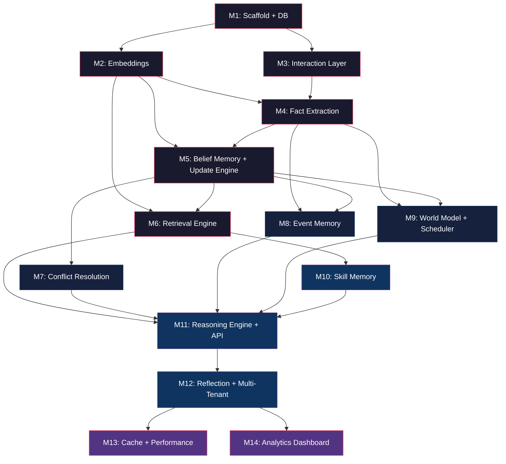

# CLARA — Implementation Plan
### Cognitive Living Memory Architecture for AI Agents
**Version 2.0 · Sequenced Build Plan**

---

> [!IMPORTANT]
> This plan is structured as **12 sequential milestones** across 4 phases. Each milestone produces a **runnable, testable artifact**. No milestone depends on anything not built in a prior milestone.

---

## Tech Stack Decision

| Layer | Technology | Rationale |
|---|---|---|
| **Language** | Python 3.11+ | Ecosystem maturity for AI/ML, async support |
| **Database** | PostgreSQL 16 + pgvector | Unified relational + vector store |
| **ORM / DB Access** | SQLAlchemy 2.0 (async) + asyncpg | Type-safe, async-native |
| **Embedding** | OpenAI `text-embedding-3-small` (primary), `nomic-embed-text` (local fallback) | 1536-dim vectors, cost-efficient |
| **LLM (extraction/reasoning)** | OpenAI GPT-4o / GPT-4o-mini | Fact extraction, conflict resolution, reflection |
| **Cache** | Redis 7+ | Hot belief cache, rate limiting |
| **API Layer** | FastAPI | Async, OpenAPI docs, dependency injection |
| **Task Scheduler** | APScheduler or Celery Beat | Decay, pruning, reflection jobs |
| **Testing** | pytest + pytest-asyncio | Async test support |
| **Containerization** | Docker + docker-compose | Reproducible local dev |

---

## Project Structure

```
CLARA/
├── docker-compose.yml              # PostgreSQL + Redis + app
├── pyproject.toml                   # Project metadata & dependencies
├── alembic/                         # DB migrations
│   ├── alembic.ini
│   └── versions/
├── clara/
│   ├── __init__.py
│   ├── config.py                    # Settings (pydantic-settings)
│   ├── main.py                      # FastAPI app entrypoint
│   │
│   ├── db/
│   │   ├── __init__.py
│   │   ├── engine.py                # Async engine + session factory
│   │   ├── models.py                # SQLAlchemy ORM models
│   │   └── migrations.py            # Alembic helpers
│   │
│   ├── core/
│   │   ├── __init__.py
│   │   ├── schemas.py               # Pydantic schemas (InteractionRecord, etc.)
│   │   ├── enums.py                 # MemoryType, Status, SourceType enums
│   │   └── exceptions.py            # Custom exceptions
│   │
│   ├── interaction/
│   │   ├── __init__.py
│   │   └── layer.py                 # Interaction Layer — input normalization
│   │
│   ├── extraction/
│   │   ├── __init__.py
│   │   ├── extractor.py             # Fact Extraction engine
│   │   ├── prompts.py               # LLM prompts for extraction
│   │   └── rules.py                 # Regex + heuristic pre-filters
│   │
│   ├── memory/
│   │   ├── __init__.py
│   │   ├── update_engine.py         # Memory Update Engine (pipeline)
│   │   ├── conflict.py              # Conflict Detection & Resolution
│   │   ├── belief.py                # Belief Memory operations
│   │   ├── event.py                 # Event Memory operations
│   │   ├── skill.py                 # Skill Memory operations
│   │   ├── world_model.py           # World Model operations
│   │   └── confidence.py            # Confidence scoring & decay math
│   │
│   ├── retrieval/
│   │   ├── __init__.py
│   │   ├── engine.py                # Vector Retrieval Engine
│   │   ├── ranking.py               # Multi-signal ranking
│   │   └── cache.py                 # Redis hot-belief cache
│   │
│   ├── reasoning/
│   │   ├── __init__.py
│   │   ├── context.py               # Context assembly for LLM
│   │   └── engine.py                # Reasoning engine (tool use, CoT)
│   │
│   ├── reflection/
│   │   ├── __init__.py
│   │   ├── pipeline.py              # Reflection & insight generation
│   │   └── prompts.py               # Reflection LLM prompts
│   │
│   ├── scheduler/
│   │   ├── __init__.py
│   │   └── jobs.py                  # Decay, pruning, reflection cron jobs
│   │
│   ├── api/
│   │   ├── __init__.py
│   │   ├── routes_interaction.py    # POST /interact
│   │   ├── routes_memory.py         # GET /memory/search, GET /memory/{id}
│   │   ├── routes_admin.py          # Debug/admin endpoints
│   │   └── middleware.py            # Tenant isolation, auth
│   │
│   └── embeddings/
│       ├── __init__.py
│       └── provider.py              # Embedding abstraction (OpenAI / local)
│
├── tests/
│   ├── conftest.py                  # Fixtures: test DB, mock LLM, etc.
│   ├── test_interaction.py
│   ├── test_extraction.py
│   ├── test_belief.py
│   ├── test_event.py
│   ├── test_skill.py
│   ├── test_world_model.py
│   ├── test_update_engine.py
│   ├── test_conflict.py
│   ├── test_retrieval.py
│   ├── test_reasoning.py
│   ├── test_reflection.py
│   └── test_scheduler.py
│
└── scripts/
    ├── seed_memory.py               # Dev: seed sample memories
    └── benchmark.py                 # Phase 4: performance benchmarks
```

---

## Phase 1 — Foundation

> **Goal:** Accept input → extract facts → store as beliefs → retrieve by similarity.
> At the end of Phase 1 you have a working memory that can learn and recall.

---

### Milestone 1: Project Scaffold & Database
**Estimated effort:** 2–3 hours

#### What to build
1. Initialize Python project with `pyproject.toml` (dependencies listed above)
2. `docker-compose.yml` with PostgreSQL 16 + pgvector extension
3. `clara/config.py` — Pydantic Settings reading from `.env`
4. `clara/db/engine.py` — Async SQLAlchemy engine + session factory
5. `clara/db/models.py` — Single `MemoryRecord` table:

```sql
CREATE EXTENSION IF NOT EXISTS vector;

CREATE TABLE memory_records (
    id              UUID PRIMARY KEY DEFAULT gen_random_uuid(),
    memory_type     VARCHAR(20) NOT NULL,   -- belief | event | skill | world_model
    content         JSONB NOT NULL,
    embedding       vector(1536),
    confidence      FLOAT DEFAULT 1.0,
    status          VARCHAR(20) DEFAULT 'active',
    decay_rate      FLOAT DEFAULT 0.005,
    user_id         VARCHAR(100) NOT NULL,  -- tenant partition key
    created_at      TIMESTAMPTZ DEFAULT NOW(),
    updated_at      TIMESTAMPTZ DEFAULT NOW(),
    metadata        JSONB DEFAULT '{}'
);

CREATE INDEX idx_memory_type ON memory_records(memory_type);
CREATE INDEX idx_status ON memory_records(status);
CREATE INDEX idx_user_id ON memory_records(user_id);
CREATE INDEX idx_embedding ON memory_records
    USING hnsw (embedding vector_cosine_ops) WITH (m = 16, ef_construction = 64);
```

6. Alembic setup with initial migration
7. `clara/core/enums.py` — `MemoryType`, `MemoryStatus`, `SourceType`
8. `clara/core/schemas.py` — Pydantic models for `InteractionRecord`, `MemoryRecord`

#### Deliverable
- `docker compose up` boots PostgreSQL with pgvector
- Alembic migrations create the schema
- Unit test: create a `MemoryRecord`, read it back

#### Test checkpoint
```bash
pytest tests/test_db.py  # CRUD on memory_records table
```

---

### Milestone 2: Embedding Provider
**Estimated effort:** 1–2 hours

#### What to build
1. `clara/embeddings/provider.py`:
   - Abstract `EmbeddingProvider` protocol
   - `OpenAIEmbeddingProvider` — calls `text-embedding-3-small`
   - `LocalEmbeddingProvider` — wraps `sentence-transformers` (offline fallback)
   - Batch embedding support (send up to 100 texts per API call)
2. Config switch: `EMBEDDING_PROVIDER=openai|local` in `.env`

#### Deliverable
- Given any text string, return a 1536-dim vector
- Fallback works when OpenAI key is missing

#### Test checkpoint
```bash
pytest tests/test_embeddings.py  # embed text, check shape, check determinism
```

---

### Milestone 3: Interaction Layer
**Estimated effort:** 1–2 hours

#### What to build
1. `clara/interaction/layer.py`:
   - `InteractionLayer.receive(raw_input, source, session_id) → InteractionRecord`
   - Normalize input: strip whitespace, assign ID, timestamp, default confidence floor
   - Validate source enum: `user | tool | api | system | file_event`
2. `clara/core/schemas.py` — finalize `InteractionRecord` schema (as in architecture doc)

#### Deliverable
- Any raw string → well-formed `InteractionRecord` with UUID, timestamp, source

#### Test checkpoint
```bash
pytest tests/test_interaction.py  # normalization, ID generation, edge cases
```

---

### Milestone 4: Fact Extraction (LLM + Rules Hybrid)
**Estimated effort:** 3–4 hours

#### What to build
1. `clara/extraction/rules.py`:
   - Regex pre-filters for negations (`no longer`, `stopped`, `switched from X to Y`)
   - Hedging detector (`maybe`, `I think`, `might`) — flag low-confidence
   - Domain context tagger (`for web work`, `at my job`)

2. `clara/extraction/prompts.py`:
   - System prompt for GPT-4o-mini extraction:
     ```
     You are a fact extraction engine. Given a user message, extract:
     - entities (subject, type)
     - relations (subject, relation, object, domain)
     - events (type, entity, description)
     - negations/corrections (what is being invalidated)
     - preferences

     Return JSON array of ExtractionCandidate objects.
     Assign confidence 0.0–1.0 to each. Discard anything below 0.4.
     ```

3. `clara/extraction/extractor.py`:
   - `FactExtractor.extract(interaction: InteractionRecord) → list[ExtractionCandidate]`
   - Pipeline: regex pre-filter → LLM extraction → confidence filter → return

4. `clara/core/schemas.py`:
   - `ExtractionCandidate` pydantic model:
     ```python
     class ExtractionCandidate(BaseModel):
         candidate_type: Literal["belief", "event", "skill", "world_model"]
         subject: str
         relation: str | None
         object: str | None
         domain: str | None
         event_type: str | None
         description: str | None
         is_negation: bool = False
         negates: str | None = None  # what it invalidates
         confidence: float
         raw_evidence: str
     ```

#### Deliverable
- `"I switched from Python to Rust for my systems work."` produces:
  - Belief candidate: `(user, uses, Rust, domain=systems, conf=0.8)`
  - Negation candidate: `(user, uses, Python, negation=True, domain=systems)`

#### Test checkpoint
```bash
pytest tests/test_extraction.py  # 10+ test cases covering entities, negations, hedging
```

---

### Milestone 5: Belief Memory + Basic Update Engine
**Estimated effort:** 3–4 hours

#### What to build
1. `clara/memory/confidence.py`:
   - `compute_confidence(prior, decay_rate, days_elapsed, source_weight, observation_strength) → float`
   - Implements the Bayesian update formula from the architecture doc
   - `apply_decay(confidence, decay_rate, days_elapsed) → float`

2. `clara/memory/belief.py`:
   - `BeliefStore.create(candidate, user_id, embedding) → MemoryRecord`
   - `BeliefStore.get_active(user_id, subject, relation) → list[MemoryRecord]`
   - `BeliefStore.supersede(old_id, new_id) → None`
   - Builds the belief JSON content matching the schema in the architecture doc

3. `clara/memory/update_engine.py` (basic version — no conflict resolution yet):
   - `UpdateEngine.process(candidates: list[ExtractionCandidate], user_id) → list[MemoryRecord]`
   - Pipeline:
     1. Embed each candidate
     2. Similarity search (top-10, threshold 0.82)
     3. If novel → create new belief
     4. If similar exists → update confidence (Bayesian)
     5. If negation → supersede matching belief

#### Deliverable
- End-to-end: raw text → extraction → belief stored in DB with embedding
- Negations correctly supersede existing beliefs

#### Test checkpoint
```bash
pytest tests/test_belief.py tests/test_update_engine.py
```

---

### Milestone 6: Vector Retrieval Engine
**Estimated effort:** 2–3 hours

#### What to build
1. `clara/retrieval/engine.py`:
   - `RetrievalEngine.search(query: str, user_id: str, top_k=8, memory_types=None) → list[ScoredMemory]`
   - Pipeline:
     1. Embed query
     2. pgvector cosine similarity search (filtered by `user_id`, `status=active`)
     3. Multi-signal scoring:
        ```
        final_score = 0.65 × similarity + 0.20 × confidence + 0.10 × recency + 0.05 × usage_freq
        ```
     4. Return top-k, grouped by memory_type

2. `clara/retrieval/ranking.py`:
   - `recency_score(updated_at) → float` — exponential decay
   - `usage_score(access_count, max_access) → float` — log-normalized
   - `composite_score(similarity, confidence, recency, usage) → float`

3. `clara/core/schemas.py`:
   - `ScoredMemory(memory: MemoryRecord, score: float, similarity: float)`

#### Deliverable
- Query "What language does the user prefer?" → retrieves belief about Rust with high score

#### Test checkpoint
```bash
pytest tests/test_retrieval.py  # seed 20 beliefs, verify ranking order
```

---

### 🏁 Phase 1 Complete Checkpoint

At this point you have a **functional memory system**:

```
Input text → Interaction Layer → Fact Extraction → Update Engine → Belief Memory → Retrieval
```

**Integration test:**
```python
async def test_end_to_end_phase1():
    # 1. User says something
    record = await interaction.receive("I use Rust for backend work", source="user")
    # 2. Extract facts
    candidates = await extractor.extract(record)
    # 3. Store in memory
    memories = await update_engine.process(candidates, user_id="user_001")
    # 4. Retrieve
    results = await retrieval.search("What programming language?", user_id="user_001")
    assert results[0].memory.content["object"] == "Rust"
```

---

## Phase 2 — Robustness

> **Goal:** Handle contradictions, track events, model live state, and implement decay.

---

### Milestone 7: Conflict Detection & Resolution
**Estimated effort:** 3–4 hours

#### What to build
1. `clara/memory/conflict.py`:
   - `ConflictDetector.detect(candidate, similar_records) → ConflictResult`
     - Returns: `no_conflict | direct_replacement | domain_scoped | temporal_overlap | source_disagreement`
   - `ConflictResolver.resolve(candidate, existing, conflict_type) → ResolutionAction`
     - Actions: `create_new | supersede | retain_both_with_tags | flag_for_review`

2. Resolution logic (from architecture doc):
   ```python
   if conflict_type == "direct_replacement":
       if candidate.confidence > 0.6 and candidate is newer:
           supersede(existing, candidate)
       elif confidence ambiguous:
           retain_both_with_domain_tags()
   elif conflict_type == "domain_scoped":
       retain_both_with_domain_tags()
   elif conflict_type == "source_disagreement":
       source_weight_arbitration()
   ```

3. Update `UpdateEngine.process()` to include conflict detection between steps 2 and 4:
   ```
   embed → similarity search → [NEW] conflict detection → [NEW] conflict resolution → write
   ```

4. Add `supersedes` and `superseded_by` fields to belief content

#### Deliverable
- "I use Python" then "I switched to Rust" → Python belief superseded, Rust active
- "I use Python at work, Rust personally" → both retained with domain tags

#### Test checkpoint
```bash
pytest tests/test_conflict.py  # all 4 conflict classes tested
```

---

### Milestone 8: Event Memory
**Estimated effort:** 2–3 hours

#### What to build
1. `clara/memory/event.py`:
   - `EventStore.create(candidate, user_id, embedding) → MemoryRecord`
   - `EventStore.update_outcome(event_id, outcome) → None`
   - `EventStore.get_timeline(user_id, entity=None, limit=20) → list[MemoryRecord]`
   - Event lifecycle: `created → in_progress → completed | failed | abandoned`

2. Update `FactExtractor` to emit `event` type candidates for action verbs:
   - "started", "completed", "deployed", "failed", "launched", "migrated"

3. Update `UpdateEngine` to route `event` candidates to `EventStore`

4. Events set `decay_rate = 0.0` — events never decay (they happened)

#### Deliverable
- "I deployed the API yesterday" → event record with `event_type=deployed`
- Timeline query returns events in chronological order

#### Test checkpoint
```bash
pytest tests/test_event.py  # event creation, lifecycle transitions, timeline
```

---

### Milestone 9: World Model + Confidence Decay Scheduler
**Estimated effort:** 3–4 hours

#### What to build
1. `clara/memory/world_model.py`:
   - `WorldModelStore.upsert(entity_type, name, properties, user_id) → MemoryRecord`
   - `WorldModelStore.update_property(model_id, key, value) → None` (with audit log)
   - `WorldModelStore.get_state(user_id, entity_type=None) → list[MemoryRecord]`
   - Mutation log stored in `metadata.mutation_history[]`:
     ```json
     {"field": "language", "old": "Python", "new": "Rust", "at": "2026-03-10T14:22:00Z"}
     ```

2. Update extraction to detect world-model facts:
   - Project descriptions, environment configurations, system states

3. `clara/scheduler/jobs.py`:
   - `decay_job()` — runs daily:
     - Apply `confidence_t = confidence_0 × e^(−decay_rate × Δt)` to all active memories
     - Archive any record where `confidence < 0.15`
   - `pruning_job()` — runs weekly:
     - Archive events > 90 days with no linked beliefs
     - Deprecate skills unused > 60 days with confidence < 0.15
     - Remove world model properties not updated in 30 days

4. APScheduler integration in `clara/main.py`

#### Deliverable
- World model stores current project state with property mutation log
- Decay job reduces confidence over time; archival job cleans stale records

#### Test checkpoint
```bash
pytest tests/test_world_model.py tests/test_scheduler.py
```

---

### 🏁 Phase 2 Complete Checkpoint

System now handles:
- ✅ Belief creation, versioning, and supersession
- ✅ Conflict detection and resolution (4 conflict classes)
- ✅ Event memory with lifecycle tracking
- ✅ World model with live state and mutation auditing
- ✅ Automated confidence decay and pruning

---

## Phase 3 — Intelligence

> **Goal:** Learn procedures, reason with memory, generate insights, isolate tenants.

---

### Milestone 10: Skill Memory with Feedback Loop
**Estimated effort:** 3–4 hours

#### What to build
1. `clara/memory/skill.py`:
   - `SkillStore.create(name, trigger_conditions, steps, source, user_id) → MemoryRecord`
   - `SkillStore.record_outcome(skill_id, success: bool, error_context=None) → None`
     - Success → `success_count++`, confidence += 0.05 (max 0.99)
     - Failure → `failure_count++`, confidence -= 0.10, append failure note
     - If confidence < 0.3 → flag for review
     - If confidence < 0.15 → status = "deprecated"
   - `SkillStore.match(context: str, user_id) → list[ScoredMemory]`
     - Semantic search on trigger conditions

2. Skill learning sources:
   - User explicit instruction: "When deploying, always run tests first"
   - Extraction from successful event sequences (Phase 3 reflection)
   - Import from documentation (future)

3. Update `UpdateEngine` to route `skill` candidates

#### Deliverable
- Store a deployment procedure, execute it, record success/failure
- Confidence adjusts with feedback; deprecated skills stop appearing in retrieval

#### Test checkpoint
```bash
pytest tests/test_skill.py  # creation, feedback loop, deprecation threshold
```

---

### Milestone 11: Reasoning Engine + Context Assembly
**Estimated effort:** 3–4 hours

#### What to build
1. `clara/reasoning/context.py`:
   - `ContextAssembler.build(query, user_id) → str`
   - Retrieves top-k memories, groups by type, formats as structured block:
     ```
     === MEMORY CONTEXT ===
     [BELIEFS]
     - User uses Rust (confidence: 0.78, domain: systems)
     [WORLD MODEL]
     - Project: systems-rewrite | Language: Rust | Status: in_progress
     [RECENT EVENTS]
     - 2026-03-10: Started systems rewrite
     [RELEVANT SKILLS]
     - Deploy Rust API (confidence: 0.82)
     === END MEMORY CONTEXT ===
     ```

2. `clara/reasoning/engine.py`:
   - `ReasoningEngine.respond(query, user_id, tools=None) → Response`
   - Pipeline:
     1. Assemble memory context
     2. Build system prompt with context injection
     3. Call LLM with user query + memory context
     4. Parse response; execute tool calls if any
     5. Feed interaction back through the full pipeline (interaction → extraction → memory)

3. `clara/api/routes_interaction.py`:
   - `POST /interact` — full pipeline endpoint:
     - Accept user message → extract → update memory → retrieve context → reason → respond
   - `POST /memory/learn` — direct memory injection (for tools/APIs feeding data)

4. `clara/api/routes_memory.py`:
   - `GET /memory/search?q=...&user_id=...` — semantic search
   - `GET /memory/{id}` — single record
   - `GET /memory/timeline?user_id=...` — event timeline
   - `GET /memory/beliefs?user_id=...&subject=...` — filtered beliefs

#### Deliverable
- Full conversational loop: user asks → memory contextualized → LLM responds → new facts stored
- REST API for all memory operations

#### Test checkpoint
```bash
pytest tests/test_reasoning.py  # context assembly, response quality, memory feedback
```

---

### Milestone 12: Reflection + Multi-Tenant Isolation
**Estimated effort:** 3–4 hours

#### What to build
1. `clara/reflection/pipeline.py`:
   - `ReflectionEngine.run(user_id) → list[MemoryRecord]`
   - Pipeline:
     1. Retrieve recent memory cluster (last 7 days, grouped by entity)
     2. Detect patterns:
        - Recurring entities → candidate belief
        - Repeated event types → behavioral pattern
        - Common skill triggers → skill generalization
     3. LLM generates insight from patterns
     4. Store as new belief with `source=agent_reflection`, `confidence=0.5`

2. `clara/reflection/prompts.py`:
   - System prompt for reflection:
     ```
     Given these recent memories, identify patterns, emerging preferences,
     or meta-observations. Return structured insights as belief candidates.
     ```

3. Add reflection trigger to scheduler:
   - Daily scheduled run
   - Threshold trigger: every N new events (configurable, default=10)

4. `clara/api/middleware.py`:
   - Tenant isolation middleware:
     - Extract `user_id` from auth header / API key
     - Inject into all DB queries as mandatory filter
     - Validate: no cross-tenant data leakage in any endpoint
   - Global skill library (read-only, opt-in):
     - Skills with `scope=global` visible to all tenants
     - Tenants cannot modify global skills

#### Deliverable
- Agent generates insights like "User systematically migrates projects to Rust"
- Full tenant isolation: user A cannot see user B's memories

#### Test checkpoint
```bash
pytest tests/test_reflection.py tests/test_middleware.py
```

---

### 🏁 Phase 3 Complete Checkpoint

System is now **fully intelligent**:
- ✅ All 4 memory types operational (belief, event, skill, world model)
- ✅ Full reasoning loop with memory-contextualized responses
- ✅ Skill learning with feedback-driven confidence
- ✅ Automated reflection and insight generation
- ✅ Multi-tenant isolation

---

## Phase 4 — Scale & Polish

> **Goal:** Optimize performance, add caching, build observability, benchmark.

---

### Milestone 13 (Bonus): Redis Cache + Performance
**Estimated effort:** 2–3 hours

1. `clara/retrieval/cache.py`:
   - Redis cache for hot beliefs (frequently accessed, high confidence)
   - Cache invalidation on belief update/supersession
   - TTL = 1 hour for cache entries, refresh on access

2. Async memory updates:
   - Background task queue for non-blocking writes
   - User gets response immediately; memory update happens async

3. `scripts/benchmark.py`:
   - Measure: retrieval latency, memory write throughput, end-to-end response time
   - Target: retrieval < 100ms (p95), write < 200ms (p95)

### Milestone 14 (Bonus): Analytics Dashboard
**Estimated effort:** 3–4 hours

1. `clara/api/routes_admin.py`:
   - `GET /admin/stats` — memory counts by type/status
   - `GET /admin/conflicts` — recent conflict resolutions
   - `GET /admin/decay-report` — beliefs approaching archival threshold
   - `GET /admin/skills/leaderboard` — skills ranked by success rate

2. Simple web dashboard (optional):
   - Memory timeline visualization
   - Belief graph (entity-relation network)
   - Confidence heatmap

---

## Dependency Graph



---

## Build Order Summary

| # | Milestone | Phase | Dependencies | Est. Hours |
|---|---|---|---|---|
| 1 | Project Scaffold & Database | 1 | — | 2–3 |
| 2 | Embedding Provider | 1 | M1 | 1–2 |
| 3 | Interaction Layer | 1 | M1 | 1–2 |
| 4 | Fact Extraction | 1 | M2, M3 | 3–4 |
| 5 | Belief Memory + Update Engine | 1 | M2, M4 | 3–4 |
| 6 | Vector Retrieval Engine | 1 | M2, M5 | 2–3 |
| 7 | Conflict Detection & Resolution | 2 | M5 | 3–4 |
| 8 | Event Memory | 2 | M4, M5 | 2–3 |
| 9 | World Model + Decay Scheduler | 2 | M4, M5 | 3–4 |
| 10 | Skill Memory + Feedback Loop | 3 | M6 | 3–4 |
| 11 | Reasoning Engine + API | 3 | M6–M10 | 3–4 |
| 12 | Reflection + Multi-Tenant | 3 | M11 | 3–4 |
| 13 | Redis Cache + Performance | 4 | M12 | 2–3 |
| 14 | Analytics Dashboard | 4 | M12 | 3–4 |
| | **Total** | | | **~35–48** |

---

## Getting Started (First Session)

When you're ready to start building, say **"Let's start Milestone 1"** and I will:

1. Create `pyproject.toml` with all dependencies
2. Set up `docker-compose.yml` for PostgreSQL + pgvector
3. Build the database models and migrations
4. Create the config system
5. Write the first tests

> [!TIP]
> Milestones 2 and 3 have no dependency on each other — they can be built in parallel after M1 is done, saving time.
