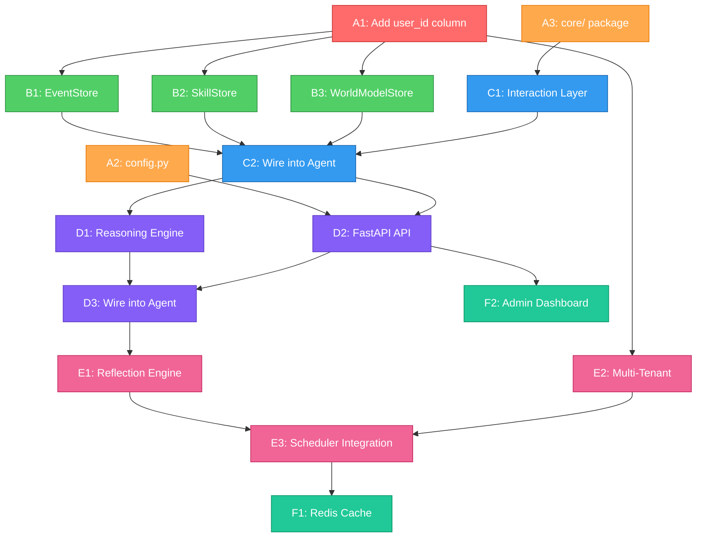

# CLARA — Pending Implementation Plan

### Phased Roadmap Aligned to Current Codebase Architecture
**Created:** 2026-03-11  
**Reference:** [implementation_status.md](file:///c:/Users/Administrator/Downloads/CLARA/CLARA/implementation_status.md)

---

> [!IMPORTANT]
> This plan is designed to **add missing functionality incrementally** without breaking any existing code or tests. Each step produces a testable deliverable. The plan respects the actual file layout (`clara/memory/`, `clara/update/`, `clara/retrieval/`, etc.) rather than the original plan's structure.

---

## Architecture Principles

Before we begin, these rules govern every change:

1. **No existing file rewrites** — we add new files and make surgical edits to existing ones
2. **No test regressions** — `pytest tests/` must pass after every step
3. **SQLite compatibility** — all new code must work with the `sqlite+aiosqlite://` backend (used in tests)
4. **No new mandatory dependencies** — new deps go into `[project.optional-dependencies]`
5. **Follow existing patterns** — use `AsyncSession`, `dataclass(frozen=True, slots=True)`, same import style

---

## Phase Overview

| Phase | Name | Steps | Estimated Hours | Risk Level |
|---|---|---|---|---|
| **A** | Schema & Config Foundation | 3 steps | 3–4h | 🟡 Medium |
| **B** | Memory Type Stores | 3 steps | 5–7h | 🟢 Low |
| **C** | Interaction Layer + Agent Wiring | 2 steps | 3–4h | 🟢 Low |
| **D** | Reasoning Engine & REST API | 3 steps | 5–7h | 🟡 Medium |
| **E** | Reflection & Multi-Tenant | 3 steps | 5–6h | 🔴 High |
| **F** | Cache, Performance & Dashboard | 2 steps | 4–5h | 🟡 Medium |
| | **Total** | **16 steps** | **~25–33h** | |

---

## Phase A — Schema & Config Foundation

> **Goal:** Add the `user_id` column, centralized config, and core schemas — the structural prerequisites everything else depends on.

---

### Step A1: Add `user_id` Column to `Memory` Model

> [!CAUTION]
> This is the highest-risk change in the entire plan. The `user_id` column is missing from the `Memory` table, but multi-tenant isolation, all planned stores, and the API layer depend on it. We add it as **nullable with a default** to avoid breaking existing tests.

**File:** [clara/db/models.py](file:///c:/Users/Administrator/Downloads/CLARA/CLARA/clara/db/models.py)

**Changes:**
```diff
 # --- Primary key ---
 memory_id: Mapped[uuid.UUID] = mapped_column(...)

+# --- Tenant ---
+user_id: Mapped[str | None] = mapped_column(
+    Text,
+    nullable=True,
+    default=None,
+    index=True,
+    comment="Tenant partition key. NULL for backwards-compat with pre-tenant data.",
+)
+
 # --- Classification ---
 memory_type: Mapped[MemoryType] = mapped_column(...)
```

**Add index to `__table_args__`:**
```diff
 __table_args__ = (
     Index("ix_memories_memory_type", "memory_type"),
     Index("ix_memories_status", "status"),
     Index("ix_memories_created_at", "created_at"),
     Index("ix_memories_type_status", "memory_type", "status"),
+    Index("ix_memories_user_id", "user_id"),
+    Index("ix_memories_user_type_status", "user_id", "memory_type", "status"),
 )
```

**Why nullable?** All existing tests create `Memory` rows without `user_id`. Making it `nullable=True` means every existing test passes unchanged. New code will pass `user_id` explicitly; old code works with `NULL`.

**Migration SQL** (add to `clara/db/migrations/002_add_user_id.sql`):
```sql
ALTER TABLE memories ADD COLUMN user_id TEXT;
CREATE INDEX ix_memories_user_id ON memories(user_id);
CREATE INDEX ix_memories_user_type_status ON memories(user_id, memory_type, status);
```

**Test checkpoint:**
```bash
pytest tests/  # ALL existing tests must still pass
```

---

### Step A2: Create `clara/config.py` — Centralized Settings

**New file:** `clara/config.py`

```python
"""
CLARA — Centralized Configuration

Uses Pydantic not required — simple dataclass + env var reads,
matching the existing pattern in extractor.py and embeddings.py.
"""
from __future__ import annotations

import os
from dataclasses import dataclass, field


@dataclass(frozen=True, slots=True)
class ClaraConfig:
    """All CLARA settings in one place."""

    # Database
    db_url: str = "sqlite+aiosqlite://"

    # Embeddings
    embedding_backend: str = "openai"          # "openai" | "local"
    openai_embedding_model: str = "text-embedding-3-small"

    # LLM (extraction / reasoning)
    llm_provider: str = "openai"               # "openai" | "anthropic"
    openai_model: str = "gpt-4o-mini"
    anthropic_model: str = "claude-3-5-haiku-20241022"

    # Retrieval
    retrieval_top_k: int = 8
    similarity_threshold: float = 0.82

    # Decay
    archival_threshold: float = 0.15
    event_stale_days: int = 90
    skill_unused_days: int = 60

    # Scheduler
    start_scheduler: bool = True

    @classmethod
    def from_env(cls) -> ClaraConfig:
        """Build config from environment variables with sensible defaults."""
        return cls(
            db_url=os.environ.get("CLARA_DB_URL", cls.db_url),
            embedding_backend=os.environ.get("CLARA_EMBEDDING_BACKEND", cls.embedding_backend),
            llm_provider=os.environ.get("CLARA_LLM_PROVIDER", cls.llm_provider),
            start_scheduler=os.environ.get("CLARA_START_SCHEDULER", "true").lower() == "true",
        )
```

**Impact on existing code:** None. This file is purely additive. `agent.py` can optionally accept a `ClaraConfig` in a future step, but the existing `create()` API remains unchanged.

**Test:** Simple unit test validating defaults and `from_env()`.

---

### Step A3: Create `clara/core/` Package — Shared Schemas & Enums

**New files:**
- `clara/core/__init__.py`
- `clara/core/schemas.py`
- `clara/core/enums.py`
- `clara/core/exceptions.py`

**`clara/core/enums.py`** — Re-exports + new enums:
```python
"""Re-export canonical enums and add new ones (e.g., SourceType, EventStatus)."""
from clara.db.models import MemoryType, MemoryStatus

# Re-export from belief.py (so other modules don't import from memory.belief)
from clara.memory.belief import SourceType

class EventStatus(str, enum.Enum):
    created = "created"
    in_progress = "in_progress"
    completed = "completed"
    failed = "failed"
    abandoned = "abandoned"
```

**`clara/core/schemas.py`** — Pydantic-free dataclasses for cross-module data:
```python
@dataclass(frozen=True, slots=True)
class InteractionRecord:
    """Normalized input record flowing from Interaction Layer → Extraction."""
    interaction_id: uuid.UUID
    raw_text: str
    source: SourceType
    session_id: str | None
    user_id: str | None
    timestamp: datetime
    metadata: dict[str, Any] = field(default_factory=dict)
```

**`clara/core/exceptions.py`** — Custom exceptions:
```python
class ClaraError(Exception): ...
class MemoryNotFoundError(ClaraError): ...
class ConflictError(ClaraError): ...
class TenantViolationError(ClaraError): ...
```

**Impact on existing code:** None — purely additive. Existing modules continue to import from their current locations. New modules will import from `clara.core`.

---

## Phase B — Memory Type Stores

> **Goal:** Build the three missing dedicated stores (Event, Skill, World Model) alongside the existing `BeliefMemory` in `clara/memory/`.

---

### Step B1: Create `clara/memory/event.py` — EventStore

**New file:** `clara/memory/event.py`

**Class:** `EventStore(session: AsyncSession)`

**Methods:**
| Method | Signature | Description |
|---|---|---|
| `create` | `(subject, relation, object_, event_type, user_id, embedding) → Memory` | Create event with `decay_rate=0.0`, initial status via `EventStatus` |
| `update_outcome` | `(event_id, outcome: EventStatus, error_context?) → Memory` | Transition lifecycle: `created → in_progress → completed/failed/abandoned` |
| `get_timeline` | `(user_id?, entity?, limit=20) → list[Memory]` | Chronological event list, newest first |
| `get` | `(memory_id) → Memory | None` | Single event lookup |

**Key design decisions:**
- Event lifecycle stored in `content["event_status"]` (not a new column — follows the existing JSONB pattern)
- `decay_rate = 0.0` always (events are permanent facts)
- Timeline query uses `created_at DESC` ordering
- If `user_id` is `None`, queries skip the `user_id` filter (backwards-compatible)

**Integration with Update Engine:**
- Surgical edit to [update/engine.py](file:///c:/Users/Administrator/Downloads/CLARA/CLARA/clara/update/engine.py) lines 486–528: route `MemoryType.event` facts through `EventStore.create()` instead of the generic `Memory()` constructor
- This mirrors how `MemoryType.belief` already routes through `BeliefMemory.store()`

**Tests:** `tests/test_event.py`
- Event creation with all fields
- Lifecycle transitions (valid + invalid state changes)
- Timeline ordering
- Filtering by entity/user_id

---

### Step B2: Create `clara/memory/skill.py` — SkillStore

**New file:** `clara/memory/skill.py`

**Class:** `SkillStore(session: AsyncSession)`

**Methods:**
| Method | Signature | Description |
|---|---|---|
| `create` | `(name, trigger_conditions, steps, source, user_id, embedding) → Memory` | Create skill with `decay_rate=0.01` |
| `record_outcome` | `(skill_id, success: bool, error_context?) → Memory` | Success: `confidence += 0.05` (max 0.99). Failure: `confidence -= 0.10`, append failure note. Auto-deprecate if `< 0.15` |
| `match` | `(context_text, user_id, top_k=5) → list[Memory]` | Semantic search on trigger conditions (uses embedding similarity) |
| `get` | `(memory_id) → Memory | None` | Single skill lookup |

**Content JSONB structure:**
```json
{
    "name": "Deploy Rust API",
    "trigger_conditions": ["deploy", "release", "ship to production"],
    "steps": ["Run tests", "Build release binary", "Push to registry", "Update DNS"],
    "success_count": 3,
    "failure_count": 1,
    "last_outcome": "success",
    "last_outcome_at": "2026-03-10T14:00:00Z"
}
```

**Integration with Update Engine:**
- Add `SkillStore` to `MemoryUpdateEngine.__init__`
- Route `MemoryType.skill` facts through `SkillStore.create()`

**Tests:** `tests/test_skill.py`
- Skill creation
- Feedback loop (success increments, failure decrements)
- Auto-deprecation threshold
- Matching via trigger conditions

---

### Step B3: Create `clara/memory/world_model.py` — WorldModelStore

**New file:** `clara/memory/world_model.py`

**Class:** `WorldModelStore(session: AsyncSession)`

**Methods:**
| Method | Signature | Description |
|---|---|---|
| `upsert` | `(entity_type, name, properties, user_id, embedding) → Memory` | Create or update a world-model entity. If entity with same `name + entity_type + user_id` exists, merge properties |
| `update_property` | `(model_id, key, value) → Memory` | Update single property with mutation log in `metadata_.mutation_history[]` |
| `get_state` | `(user_id?, entity_type?) → list[Memory]` | Current active world model snapshot |
| `get` | `(memory_id) → Memory | None` | Single lookup |

**Content JSONB structure:**
```json
{
    "entity_type": "project",
    "name": "systems-rewrite",
    "properties": {
        "language": "Rust",
        "status": "in_progress",
        "team_size": 3
    }
}
```

**Mutation history in `metadata_`:**
```json
{
    "mutation_history": [
        {"field": "language", "old": "Python", "new": "Rust", "at": "2026-03-10T14:22:00Z"},
        {"field": "status", "old": "planning", "new": "in_progress", "at": "2026-03-11T09:00:00Z"}
    ]
}
```

**Integration with Update Engine:**
- Route `MemoryType.world_model` facts through `WorldModelStore.upsert()`
- Upsert logic: if entity exists → merge properties + log mutations; else create new

**Tests:** `tests/test_world_model.py`
- Entity creation
- Property upsert with mutation log
- Duplicate entity detection (same name + type → merge, not duplicate)
- State snapshot query

---

## Phase C — Interaction Layer + Agent Wiring

> **Goal:** Add input normalization and wire the new stores into the existing agent.

---

### Step C1: Create `clara/interaction/` Package — Input Normalization

**New files:**
- `clara/interaction/__init__.py`
- `clara/interaction/layer.py`

**Class:** `InteractionLayer`

**Single method:**
```python
class InteractionLayer:
    def receive(
        self,
        raw_input: str,
        *,
        source: SourceType = SourceType.user_direct,
        session_id: str | None = None,
        user_id: str | None = None,
    ) -> InteractionRecord:
        """Normalize raw input into a structured InteractionRecord."""
```

**Normalization pipeline:**
1. Strip leading/trailing whitespace
2. Collapse multiple whitespace runs into single spaces
3. Assign UUID (`interaction_id`)
4. Set timestamp (`datetime.now(UTC)`)
5. Validate `source` enum
6. Set default `confidence_floor = 0.4`
7. Return `InteractionRecord`

**Key design decision:** This layer is **synchronous**, stateless, and has **zero dependencies** on the database or LLM. It's pure data normalization.

**Edit to `clara/agent.py`:** Add as optional — the old `remember(text)` signature still works:
```diff
 async def remember(self, text: str) -> list[dict[str, Any]]:
+    # Optional: normalize via InteractionLayer if available
+    # For backwards compat, raw text is still accepted
```

**Tests:** `tests/test_interaction.py`
- Whitespace normalization
- UUID assignment
- Timestamp assignment
- Source validation
- Empty/whitespace-only input rejection

---

### Step C2: Wire New Stores + `user_id` into Agent & Update Engine

**Surgical edits to existing files:**

**1.** [update/engine.py](file:///c:/Users/Administrator/Downloads/CLARA/CLARA/clara/update/engine.py):
```diff
 class MemoryUpdateEngine:
     def __init__(self, session, embedding_engine, retrieval_engine) -> None:
         self._session = session
         self._embedder = embedding_engine
         self._retriever = retrieval_engine
         self._belief_memory = BeliefMemory(session)
+        self._event_store = EventStore(session)
+        self._skill_store = SkillStore(session)
+        self._world_model_store = WorldModelStore(session)
```

```diff
-    async def process(self, fact: ExtractedFact) -> UpdateResult:
+    async def process(self, fact: ExtractedFact, *, user_id: str | None = None) -> UpdateResult:
```

Route facts through the appropriate store based on `memory_type`:
```diff
 async def _store_fact(self, fact, memory_type):
     if memory_type == MemoryType.belief:
         return await self._belief_memory.store(...)
+    elif memory_type == MemoryType.event:
+        return await self._event_store.create(...)
+    elif memory_type == MemoryType.skill:
+        return await self._skill_store.create(...)
+    elif memory_type == MemoryType.world_model:
+        return await self._world_model_store.upsert(...)
     # Non-belief types: create directly  ← this fallback remains for safety
```

**2.** [agent.py](file:///c:/Users/Administrator/Downloads/CLARA/CLARA/clara/agent.py):
```diff
-    async def remember(self, text: str) -> list[dict[str, Any]]:
+    async def remember(self, text: str, *, user_id: str | None = None) -> list[dict[str, Any]]:
```

- Pass `user_id` to `update_engine.process(fact, user_id=user_id)`

**3.** [memory/belief.py](file:///c:/Users/Administrator/Downloads/CLARA/CLARA/clara/memory/belief.py):
```diff
 async def store(self, *, subject, relation, object_, domain=None,
-                is_negation=False, source=SourceType.user_direct, ...):
+                is_negation=False, source=SourceType.user_direct,
+                user_id: str | None = None, ...):
```

All `user_id` parameters are **optional** → zero breakage on existing tests.

**Test checkpoint:**
```bash
pytest tests/  # ALL existing tests still pass
pytest tests/test_event.py tests/test_skill.py tests/test_world_model.py  # new tests pass
```

---

## Phase D — Reasoning Engine & REST API

> **Goal:** Build the reasoning loop and expose everything via FastAPI.
>
> **Status:** Implemented. The repository now includes `clara/reasoning/`, `clara/api/`, `clara/main.py`, `ClaraMemory.interact()`, and dedicated tests for reasoning and API flows.

---

### Step D1: Create `clara/reasoning/` Package — Context Assembly + Reasoning Loop

**New files:**
- `clara/reasoning/__init__.py`
- `clara/reasoning/context.py`
- `clara/reasoning/engine.py`

**`clara/reasoning/context.py`** — Refactor from `agent.py`:

Move the existing `format_context()`, `_format_belief()`, `_format_event()`, `_format_skill()`, `_format_world_model()` into this new module. Add `agent.py` re-exports so nothing breaks:

```python
# clara/reasoning/context.py
class ContextAssembler:
    def __init__(self, retrieval_engine: RetrievalEngine):
        self._retriever = retrieval_engine

    async def build(self, query: str, *, user_id: str | None = None, top_k: int = 8) -> str:
        result = await self._retriever.search(query, top_k=top_k)
        return format_context(result)
```

```python
# clara/agent.py — backwards-compat re-export
from clara.reasoning.context import format_context  # re-export
```

**`clara/reasoning/engine.py`:**
```python
class ReasoningEngine:
    """Full reasoning loop: query → memory context → LLM → extract new facts → respond."""

    def __init__(self, session, embedding_engine, llm_provider, extractor, update_engine):
        ...

    async def respond(
        self,
        query: str,
        *,
        user_id: str | None = None,
        system_prompt: str | None = None,
    ) -> ReasoningResponse:
        """
        Pipeline:
        1. Assemble memory context via ContextAssembler
        2. Build system prompt with context injection
        3. Call LLM with user query + memory context
        4. Extract new facts from the LLM response
        5. Store extracted facts back into memory
        6. Return response + metadata
        """
```

**`ReasoningResponse` dataclass:**
```python
@dataclass(frozen=True, slots=True)
class ReasoningResponse:
    text: str                          # LLM response text
    memory_context: str                # The injected context block
    facts_stored: list[UpdateResult]   # Any new facts extracted from the response
    memories_used: list[ScoredMemory]  # Memories that influenced the response
```

**Tests:** `tests/test_reasoning.py`
- Context assembly produces correct format
- Reasoning loop calls LLM and extracts facts from response (mock LLM)
- Response contains memory context and stored facts metadata

---

### Step D2: Create `clara/api/` Package — FastAPI REST Layer

**New files:**
- `clara/api/__init__.py`
- `clara/api/app.py` — FastAPI app creation
- `clara/api/routes_interaction.py` — `POST /interact`, `POST /memory/learn`
- `clara/api/routes_memory.py` — `GET /memory/search`, `GET /memory/{id}`, `GET /memory/timeline`, `GET /memory/beliefs`
- `clara/api/dependencies.py` — DI for session, engines

**New dependency in `pyproject.toml`:**
```diff
 dependencies = [
     "sqlalchemy>=2.0,<3.0",
     "asyncpg>=0.29,<1.0",
     "pgvector>=0.3,<1.0",
     "apscheduler>=3.10,<4.0",
     "openai>=1.0,<3.0",
 ]
+
+[project.optional-dependencies]
+api = [
+    "fastapi>=0.115,<1.0",
+    "uvicorn[standard]>=0.30,<1.0",
+]
```

**Route definitions:**

| Method | Path | Handler | Description |
|---|---|---|---|
| `POST` | `/interact` | `interact()` | Full pipeline: message → extract → memory → context → LLM → respond |
| `POST` | `/memory/learn` | `learn()` | Direct memory injection (tools/APIs feed data) |
| `GET` | `/memory/search` | `search()` | Semantic search: `?q=...&user_id=...&top_k=8` |
| `GET` | `/memory/{memory_id}` | `get_memory()` | Single memory record by UUID |
| `GET` | `/memory/timeline` | `timeline()` | Event timeline: `?user_id=...&entity=...&limit=20` |
| `GET` | `/memory/beliefs` | `beliefs()` | Filtered beliefs: `?user_id=...&subject=...&relation=...` |

**`clara/api/app.py`:**
```python
def create_app(config: ClaraConfig | None = None) -> FastAPI:
    """Factory function — creates the FastAPI app with all routes."""
    app = FastAPI(title="CLARA Memory API", version="0.1.0")
    # Register lifespan events, DI, routes
    app.include_router(interaction_router, prefix="/interact")
    app.include_router(memory_router, prefix="/memory")
    return app
```

**`clara/main.py`:**
```python
"""Entrypoint for running CLARA as a standalone service."""
import uvicorn
from clara.api.app import create_app

app = create_app()

if __name__ == "__main__":
    uvicorn.run("clara.main:app", host="0.0.0.0", port=8000, reload=True)
```

**Tests:** Mock-based API tests using `httpx.AsyncClient` + `app.dependency_overrides`

---

### Step D3: Wire Reasoning Engine into Agent

**Surgical edit to** [agent.py](file:///c:/Users/Administrator/Downloads/CLARA/CLARA/clara/agent.py):

Add a new method (does not change existing ones):
```diff
+    async def interact(
+        self,
+        message: str,
+        *,
+        user_id: str | None = None,
+        system_prompt: str | None = None,
+    ) -> dict[str, Any]:
+        """Full interaction loop: remember + reason + respond."""
+        async with self._session_factory() as session:
+            async with session.begin():
+                reasoning = ReasoningEngine(...)
+                response = await reasoning.respond(message, user_id=user_id)
+        return {
+            "response": response.text,
+            "facts_stored": len(response.facts_stored),
+            "memories_used": len(response.memories_used),
+        }
```

The existing `remember()`, `recall()`, `context_for()` remain untouched.

---

## Phase E — Reflection & Multi-Tenant

> **Goal:** Add automated insight generation and tenant isolation.
>
> **Status:** Implemented. The repository now includes `clara/reflection/`, reflection-aware scheduler wiring, tenant-scoped retrieval/update paths, and dedicated reflection tests.

---

### Step E1: Create `clara/reflection/` Package

**New files:**
- `clara/reflection/__init__.py`
- `clara/reflection/pipeline.py`
- `clara/reflection/prompts.py`

**`clara/reflection/pipeline.py`:**
```python
class ReflectionEngine:
    def __init__(self, session, embedding_engine, llm_provider):
        ...

    async def run(self, user_id: str) -> list[Memory]:
        """
        Pipeline:
        1. Retrieve recent memory cluster (last 7 days, grouped by entity)
        2. Detect patterns:
           - Recurring entities → candidate belief
           - Repeated event types → behavioral pattern
           - Common skill triggers → skill generalization
        3. LLM generates insight from patterns
        4. Store as new belief with source=agent_reflection, confidence=0.5
        """
```

**Pattern detection (rule-based, no LLM needed):**
```python
def _detect_patterns(memories: list[Memory]) -> list[PatternCandidate]:
    """Group by entity → count occurrences → flag recurring."""
    entity_counts: dict[str, int] = {}
    for mem in memories:
        subject = mem.content.get("subject", "")
        if subject:
            entity_counts[subject] = entity_counts.get(subject, 0) + 1
    # Entities appearing 3+ times → candidate belief
    return [
        PatternCandidate(entity=e, count=c, pattern_type="recurring_entity")
        for e, c in entity_counts.items()
        if c >= 3
    ]
```

**Scheduler integration:**
- Add `reflection_job()` to `clara/scheduler/decay.py` — reuses existing `DecayScheduler`
- Trigger: daily + every N new events (configurable)

**Tests:** `tests/test_reflection.py`
- Pattern detection from seeded memories
- Insight generation (mock LLM)
- Insights stored as new beliefs with `source=agent_reflection`

---

### Step E2: Add Multi-Tenant Isolation

**Approach:** Rather than middleware (which requires FastAPI), we enforce tenant isolation at the **store level** — every query method that touches `Memory` rows filters by `user_id` when it is not `None`.

**Surgical edits:**

**1.** [memory/belief.py](file:///c:/Users/Administrator/Downloads/CLARA/CLARA/clara/memory/belief.py) — `get_active_beliefs()`:
```diff
 async def get_active_beliefs(
     self,
     subject: str | None = None,
     relation: str | None = None,
     domain: str | None = None,
+    user_id: str | None = None,
     limit: int = 50,
 ) -> Sequence[Memory]:
     filters = [
         Memory.memory_type == MemoryType.belief,
         Memory.status == MemoryStatus.active,
     ]
+    if user_id is not None:
+        filters.append(Memory.user_id == user_id)
```

**2.** [retrieval/engine.py](file:///c:/Users/Administrator/Downloads/CLARA/CLARA/clara/retrieval/engine.py) — `search()`:
```diff
 async def search(
     self,
     query: str,
     *,
     top_k: int = 8,
     memory_types: Sequence[MemoryType] | None = None,
+    user_id: str | None = None,
     track_access: bool = True,
 ) -> RetrievalResult:
```

Pass `user_id` into `_fetch_candidates()` which adds `Memory.user_id == user_id` to its WHERE clause when non-`None`.

**3. All new stores (Event, Skill, WorldModel):** Already accept `user_id` by design.

**4. API middleware (once FastAPI exists):**
```python
# clara/api/middleware.py
class TenantMiddleware:
    """Extract user_id from X-User-Id header or API key, inject into request state."""
```

**Important:** When `user_id=None`, queries return ALL records (no filtering). This preserves full backwards compatibility with every existing test.

**Tests:** `tests/test_tenant_isolation.py`
- User A cannot see User B's memories
- Queries with `user_id=None` return all records
- Store operations with `user_id` set it correctly

---

### Step E3: Reflection Scheduler Integration

**Surgical edit to** [scheduler/decay.py](file:///c:/Users/Administrator/Downloads/CLARA/CLARA/clara/scheduler/decay.py):

```diff
 class DecayScheduler:
-    def __init__(self, session_factory):
+    def __init__(self, session_factory, embedding_engine=None, llm_provider=None):
         self._session_factory = session_factory
+        self._embedding_engine = embedding_engine
+        self._llm_provider = llm_provider
         self._scheduler = AsyncIOScheduler(timezone="UTC")

     def start(self) -> None:
         self._scheduler.add_job(self.run_daily_decay, ...)
         self._scheduler.add_job(self.run_weekly_pruning, ...)
+        if self._embedding_engine and self._llm_provider:
+            self._scheduler.add_job(
+                self.run_daily_reflection,
+                trigger=CronTrigger(hour=3, minute=0, timezone="UTC"),
+                id="daily_reflection",
+                name="Daily reflection & insight generation",
+                replace_existing=True,
+            )
```

**The new `__init__` parameters are optional** — existing calls to `DecayScheduler(session_factory)` keep working. Reflection only activates when both `embedding_engine` and `llm_provider` are provided.

---

## Phase F — Cache, Performance & Dashboard

> **Goal:** Add Redis caching for hot beliefs, async writes, and admin endpoints.
>
> **Status:** Implemented for the current architecture. The repository now includes `clara/retrieval/cache.py`, `clara/update/background.py`, cache-aware retrieval/update wiring, and `clara/api/routes_admin.py` with dedicated tests.

---

### Step F1: Redis Cache + Async Background Writes

**New files:**
- `clara/retrieval/cache.py`

**New optional dependency in `pyproject.toml`:**
```diff
 [project.optional-dependencies]
+cache = [
+    "redis[hiredis]>=5.0,<6.0",
+]
```

**`clara/retrieval/cache.py`:**
```python
class MemoryCache:
    """Redis-backed hot-belief cache with TTL and invalidation."""

    def __init__(self, redis_url: str = "redis://localhost:6379/0"):
        ...

    async def get(self, user_id: str, query_hash: str) -> list[ScoredMemory] | None:
        ...

    async def set(self, user_id: str, query_hash: str, results: list[ScoredMemory], ttl: int = 3600):
        ...

    async def invalidate(self, user_id: str):
        """Called when beliefs are updated/superseded for this user."""
        ...
```

**Integration:** `RetrievalEngine` gets an optional `cache: MemoryCache | None` parameter:
```diff
 class RetrievalEngine:
-    def __init__(self, session, embedding_engine, *, candidate_multiplier=4):
+    def __init__(self, session, embedding_engine, *, candidate_multiplier=4, cache=None):
+        self._cache = cache
```

In `search()`: check cache first → if miss, query DB → store in cache → return.

**Async background writes:**
```python
# clara/update/background.py
import asyncio

class BackgroundWriter:
    """Queue memory writes for async processing."""

    def __init__(self, session_factory, embedding_engine, retrieval_engine):
        self._queue: asyncio.Queue = asyncio.Queue()
        ...

    async def enqueue(self, fact: ExtractedFact, user_id: str | None = None):
        await self._queue.put((fact, user_id))

    async def _worker(self):
        while True:
            fact, user_id = await self._queue.get()
            async with self._session_factory() as session:
                async with session.begin():
                    engine = MemoryUpdateEngine(session, ...)
                    await engine.process(fact, user_id=user_id)
```

**Tests:** Mock Redis, verify cache hit/miss behavior, TTL expiry.

---

### Step F2: Admin API + Dashboard Endpoints

**New file:** `clara/api/routes_admin.py`

| Method | Path | Description |
|---|---|---|
| `GET` | `/admin/stats` | Memory counts by type/status |
| `GET` | `/admin/conflicts` | Recent conflict resolutions (last 50) |
| `GET` | `/admin/decay-report` | Beliefs approaching archival threshold (< 0.25) |
| `GET` | `/admin/skills/leaderboard` | Skills ranked by success rate |
| `GET` | `/admin/health` | System health check |

**Implementation:** Simple SQLAlchemy aggregation queries — no new models needed.

Example:
```python
@router.get("/stats")
async def stats(session: AsyncSession = Depends(get_session)):
    result = await session.execute(
        select(Memory.memory_type, Memory.status, func.count())
        .group_by(Memory.memory_type, Memory.status)
    )
    return {"counts": [{"type": r[0].value, "status": r[1].value, "count": r[2]} for r in result]}
```

---

## Infrastructure Additions (Parallel Track)

These can be done **at any point** independently of the phases above:

### Docker Compose

**New file:** `docker-compose.yml`
```yaml
services:
  postgres:
    image: pgvector/pgvector:pg16
    environment:
      POSTGRES_DB: clara
      POSTGRES_USER: clara
      POSTGRES_PASSWORD: clara_dev
    ports:
      - "5432:5432"
    volumes:
      - pgdata:/var/lib/postgresql/data

  redis:
    image: redis:7-alpine
    ports:
      - "6379:6379"

volumes:
  pgdata:
```

### Alembic Setup

```bash
# After installing alembic
alembic init alembic
# Configure alembic.ini with async driver
# Generate initial migration from current models
alembic revision --autogenerate -m "initial schema"
```

---

## Dependency Graph



---

## Execution Order Summary

| Order | Step | What | New/Edit | Dependencies |
|---|---|---|---|---|
| 1 | **A1** | Add `user_id` to Memory model | Edit `models.py` | — |
| 2 | **A2** | Create `config.py` | New file | — |
| 3 | **A3** | Create `core/` package | New files | — |
| 4 | **B1** | EventStore | New `memory/event.py` | A1 |
| 5 | **B2** | SkillStore | New `memory/skill.py` | A1 |
| 6 | **B3** | WorldModelStore | New `memory/world_model.py` | A1 |
| 7 | **C1** | Interaction Layer | New `interaction/layer.py` | A3 |
| 8 | **C2** | Wire stores into Agent + Update Engine | Edit `agent.py`, `update/engine.py` | B1-B3, C1 |
| 9 | **D1** | Reasoning Engine | New `reasoning/` package | C2 |
| 10 | **D2** | FastAPI REST API | New `api/` package | A2, C2 |
| 11 | **D3** | Wire Reasoning into Agent | Edit `agent.py` | D1, D2 |
| 12 | **E1** | Reflection Engine | New `reflection/` package | D3 |
| 13 | **E2** | Multi-Tenant Isolation | Edit retrieval, stores | A1, D2 |
| 14 | **E3** | Reflection Scheduler | Edit `scheduler/decay.py` | E1, E2 |
| 15 | **F1** | Redis Cache + Async Writes | New `retrieval/cache.py` | E3 |
| 16 | **F2** | Admin Dashboard API | New `api/routes_admin.py` | D2 |

---

> [!TIP]
> **Recommended starting session:** Steps A1 → A2 → A3 → B1 can be done in a single 3–4 hour session with full test verification at each step. This gives you the foundation for everything that follows.

> [!TIP]
> **Quick wins:** Steps B1, B2, B3 (the three stores) are independent of each other and can be built in parallel if multiple people are working on the project.

---

## Appendix: Phase B Detailed Execution Plan

This appendix expands **Phase B - Memory Type Stores** against the current codebase rather than the original greenfield architecture.

### Current starting point

Before any Phase B code is written, these facts are already true:

- `MemoryType.event`, `MemoryType.skill`, and `MemoryType.world_model` already exist in `clara/db/models.py`
- `MemoryUpdateEngine` already classifies those types in `clara/update/engine.py`
- non-belief memory types are currently persisted through one generic `_store_fact()` path
- `user_id` already exists on `Memory`, so Phase B does **not** need a new schema change
- the extractor still produces `subject / relation / object` triples, not rich structured event or property payloads
- retrieval, context formatting, and the scheduler all still depend on the unified `Memory` table

That means Phase B should be implemented as a compatibility-first refactor:

1. introduce dedicated store classes
2. move type-specific write and lifecycle logic into those stores
3. keep the unified `Memory` table as the only persistence layer
4. preserve current retrieval behavior and current content keys where needed

### Phase B exit criteria

Phase B is done only when:

- `clara/memory/event.py` exists and is used by the update engine
- `clara/memory/skill.py` exists and is used by the update engine
- `clara/memory/world_model.py` exists and is used by the update engine
- each store has a direct test module
- existing tests still pass unchanged
- the generic non-belief creation path is no longer the primary implementation path

### Recommended internal order

Build the three stores in this order:

1. `EventStore`
2. `SkillStore`
3. `WorldModelStore`

Why this order:

- events are closest to the current generic implementation
- skills add lifecycle behavior but can still be bootstrapped from triples
- world model needs the most compatibility glue between triple extraction and property-upsert semantics

After each sub-step run:

```bash
pytest tests/test_<store>.py --tb=short -q
pytest tests/test_update_engine.py tests/test_integration.py --tb=short -q
pytest --tb=short -q
```

### B1 Detailed Design - EventStore

#### Scope

`EventStore` should extract event-specific logic out of the current generic `MemoryType.event` branch without changing how retrieval currently sees events.

#### Keep these compatibility rules

- keep `subject`, `relation`, and `object` in `content`
- keep event rows in the unified `memories` table
- keep `decay_rate = 0.0`
- keep scheduler compatibility with `metadata_["related_beliefs"]`

#### Recommended public API

```python
class EventStore:
    def __init__(self, session: AsyncSession) -> None: ...

    async def create(
        self,
        *,
        subject: str,
        relation: str,
        object_: str,
        event_type: str | None = None,
        domain: str | None = None,
        source_type: str | None = None,
        raw_text: str | None = None,
        user_id: str | None = None,
        confidence: float = 0.8,
        embedding: list[float] | None = None,
        event_status: str = "created",
        related_beliefs: list[str] | None = None,
    ) -> Memory: ...
```

Use `content` like this:

```json
{
  "subject": "user",
  "relation": "deployed",
  "object": "service",
  "event_type": "deployed",
  "event_status": "created",
  "domain": "production"
}
```

Use `metadata_` like this:

```json
{
  "source_type": "user_direct",
  "raw_text": "I deployed the service",
  "related_beliefs": [],
  "outcome_history": []
}
```

#### Event lifecycle rules

Model transitions explicitly. A small local enum is enough for Phase B if `clara/core/enums.py` does not exist yet.

Allowed transitions:

- `created -> in_progress`
- `created -> completed`
- `created -> failed`
- `created -> abandoned`
- `in_progress -> completed`
- `in_progress -> failed`
- `in_progress -> abandoned`

Disallowed:

- anything after `completed`
- anything after `failed`
- anything after `abandoned`

On `update_outcome(...)`:

- validate the transition
- update `content["event_status"]`
- append to `metadata_["outcome_history"]`
- update `updated_at`

#### Update-engine wiring

In `clara/update/engine.py`:

- add `self._event_store = EventStore(session)` to `__init__`
- route `MemoryType.event` through `EventStore.create(...)`
- do **not** redesign event conflict semantics yet; Phase B is only about introducing the dedicated store

#### Tests to add

`tests/test_event.py` should cover:

- creation populates `event_type` and `event_status`
- creation preserves triple fields
- `decay_rate == 0.0`
- valid lifecycle transitions
- invalid lifecycle transitions raise
- timeline ordering by `created_at DESC`
- optional `user_id` filtering
- update-engine integration path

#### Implementation note

Do not remove the generic fallback immediately. Keep it as a safety net until the new tests and the full suite pass.

### B2 Detailed Design - SkillStore

#### Scope

`SkillStore` should add explicit skill lifecycle behavior while still supporting the current fact-extraction pipeline, which only emits triples like:

```text
user knows kubernetes
```

#### Core compatibility problem

The long-term skill model wants:

- a human-readable skill name
- trigger conditions
- ordered steps
- success and failure feedback

But the current extractor does **not** produce steps or trigger-condition lists.

So Phase B should support two creation modes:

1. structured creation for future code
2. fact-derived creation for the current update engine

#### Recommended public API

```python
class SkillStore:
    def __init__(
        self,
        session: AsyncSession,
        retrieval_engine: RetrievalEngine | None = None,
    ) -> None: ...

    async def create(
        self,
        *,
        name: str,
        trigger_conditions: list[str],
        steps: list[str],
        source: str,
        user_id: str | None = None,
        confidence: float = 0.8,
        embedding: list[float] | None = None,
        metadata: dict[str, Any] | None = None,
    ) -> Memory: ...

    async def create_from_fact(
        self,
        *,
        subject: str,
        relation: str,
        object_: str,
        domain: str | None = None,
        source_type: str | None = None,
        raw_text: str | None = None,
        user_id: str | None = None,
        confidence: float = 0.8,
        embedding: list[float] | None = None,
    ) -> Memory: ...
```

#### Structured content shape

```json
{
  "name": "Deploy Rust API",
  "trigger_conditions": ["deploy", "release", "ship"],
  "steps": ["Run tests", "Build binary", "Deploy"],
  "success_count": 0,
  "failure_count": 0,
  "last_outcome": null,
  "last_outcome_at": null
}
```

#### Fact-derived content shape

For current update-engine ingestion, bootstrap a minimal skill row:

```json
{
  "name": "kubernetes",
  "subject": "user",
  "relation": "knows",
  "object": "kubernetes",
  "domain": null,
  "trigger_conditions": ["user", "knows", "kubernetes"],
  "steps": [],
  "success_count": 0,
  "failure_count": 0,
  "last_outcome": null,
  "last_outcome_at": null
}
```

This keeps context formatting clean because `agent.py` already prefers `content["name"]` for skills.

#### Feedback loop behavior

On success:

- increment `success_count`
- set `last_outcome = "success"`
- set `last_outcome_at = now`
- increase confidence by `0.05`, clamp to `0.99`

On failure:

- increment `failure_count`
- set `last_outcome = "failure"`
- set `last_outcome_at = now`
- append `error_context` to `metadata_["failure_notes"]`
- decrease confidence by `0.10`, clamp to `0.0`
- if confidence drops below `0.15`, set `status = MemoryStatus.deprecated`

Keep scheduler behavior unchanged. The new store should cooperate with the existing daily decay and weekly pruning jobs rather than replacing them.

#### Matching strategy

Do not create a second ranking system.

`match(context_text, user_id, top_k)` should reuse `RetrievalEngine.search(...)` with:

- `memory_types=[MemoryType.skill]`
- `top_k=top_k`
- optional `user_id`

Return the underlying `Memory` rows, not a separate result format.

#### Update-engine wiring

In `clara/update/engine.py`:

- add `self._skill_store = SkillStore(session, retrieval_engine)`
- route `MemoryType.skill` through `SkillStore.create_from_fact(...)`

Do not try to teach the extractor to emit `steps` in Phase B. That belongs to a later phase.

#### Tests to add

`tests/test_skill.py` should cover:

- structured skill creation
- fact-derived skill creation
- success feedback increments confidence and counters
- failure feedback decrements confidence and stores failure notes
- auto-deprecation below threshold
- match via retrieval
- update-engine integration path

### B3 Detailed Design - WorldModelStore

#### Scope

`WorldModelStore` is the most sensitive Phase B change because it needs to support upsert and mutation history while remaining compatible with the current triple-shaped extractor and formatter.

#### Core compatibility rule

World-model rows should store **both**:

- canonical state fields: `entity_type`, `name`, `properties`
- compatibility fields: `subject`, `relation`, `object`

#### Recommended public API

```python
class WorldModelStore:
    def __init__(self, session: AsyncSession) -> None: ...

    async def upsert(
        self,
        *,
        entity_type: str,
        name: str,
        properties: dict[str, Any],
        user_id: str | None = None,
        confidence: float = 0.8,
        embedding: list[float] | None = None,
        source_type: str | None = None,
        raw_text: str | None = None,
        triple: tuple[str, str, str] | None = None,
    ) -> Memory: ...

    async def upsert_from_fact(
        self,
        *,
        subject: str,
        relation: str,
        object_: str,
        domain: str | None = None,
        user_id: str | None = None,
        confidence: float = 0.8,
        embedding: list[float] | None = None,
        source_type: str | None = None,
        raw_text: str | None = None,
    ) -> Memory: ...
```

#### Canonical content shape

```json
{
  "entity_type": "entity",
  "name": "staging_cluster",
  "properties": {
    "has": "3 nodes"
  },
  "subject": "staging_cluster",
  "relation": "has",
  "object": "3 nodes"
}
```

#### Why `upsert_from_fact()` is required

The extractor cannot yet emit rich property dictionaries. It only emits triples.

So for Phase B:

- `name = subject`
- `entity_type = "entity"` by default
- `properties = {relation: object}`
- if `domain` exists, also copy it into `properties["domain"]`

This lets world-model storage become smarter without forcing extractor changes.

#### Identity and merge rules

Treat an active world-model row as the same logical entity when:

- `memory_type == MemoryType.world_model`
- `status == MemoryStatus.active`
- `user_id` matches
- `content["entity_type"] == entity_type`
- `content["name"] == name`

On upsert:

- add any new keys
- overwrite changed keys
- do nothing for identical values
- append only real changes to `metadata_["mutation_history"]`

Mutation entry shape:

```json
{
  "field": "status",
  "old": "planning",
  "new": "in_progress",
  "at": "2026-03-11T09:00:00Z"
}
```

#### Update-engine wiring

In `clara/update/engine.py`:

- add `self._world_model_store = WorldModelStore(session)`
- route `MemoryType.world_model` through `WorldModelStore.upsert_from_fact(...)`

This is the only Phase B step that should intentionally change duplicate behavior: world-model duplicates should merge rather than accumulate.

#### Tests to add

`tests/test_world_model.py` should cover:

- structured upsert creates a new row
- fact-derived upsert creates a compatible row
- second upsert with same logical identity merges instead of duplicating
- mutation history records changed fields only
- unchanged values do not create mutation noise
- `get_state()` filters by `user_id` and `entity_type`
- update-engine integration path

### Shared Phase B review checklist

Before moving to Phase C, verify all of this:

- each new store writes to the unified `Memory` table only
- all new store APIs accept `user_id: str | None = None`
- event rows always use `decay_rate = 0.0`
- skill rows remain compatible with scheduler decay and deprecation
- world-model rows preserve compatibility fields for current retrieval/context logic
- SQLite tests pass without PostgreSQL-only SQL
- `MemoryUpdateEngine` remains the only orchestration layer

### Explicitly out of scope for Phase B

Do **not** include these in this phase:

- richer extraction schemas for event payloads or property dicts
- tool-driven reasoning or response generation
- skill synthesis from event sequences
- REST API work
- tenant middleware
- reflection jobs

Those belong to later phases and should not be pulled into the store-layer implementation.
