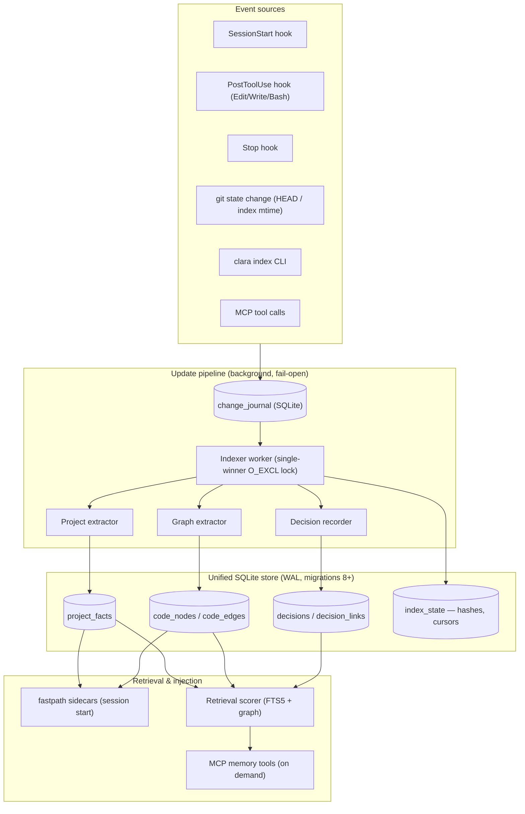
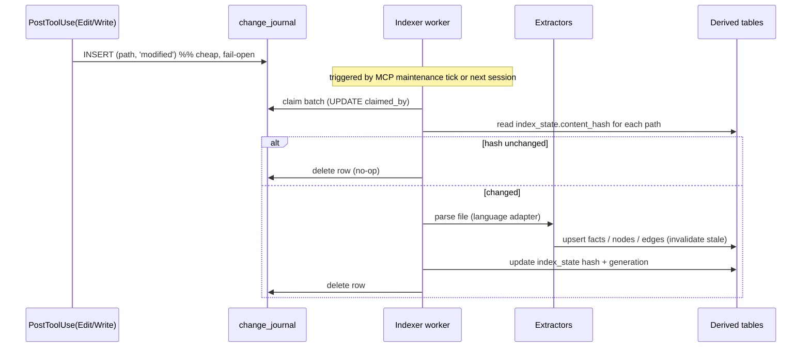
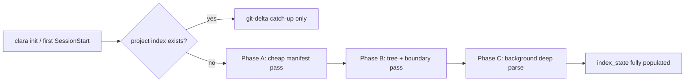
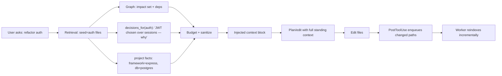

# CLARA Memory Systems Plan: Project Memory, Graph Memory & Decision Memory

Status: **PLAN — design only, no implementation.**
Author: architecture planning session, 2026-07-26.
Scope: three new persistent memory systems that make CLARA behave like an
engineer who already knows the codebase, instead of rediscovering it every
request — plus how they are scanned and stored at setup time.

This document is a plan. It proposes schemas, interfaces, workers, and phases.
Nothing here is built yet. Every code path named as "existing" is real in this
repo today; everything named as "new" is proposed.

---

## 0. Grounding in what CLARA already is

This plan builds on infrastructure that already exists and is battle-tested in
this repo, rather than inventing a parallel stack.

| Existing asset | Where | Reused for |
|---|---|---|
| Single SQLite store, WAL, forward-only migrations (`SCHEMA_VERSION`, frozen DDL, `SchemaTooNew` read-only gate) | `clara/db/migrations.py` | All new tables ship as migrations 8+ |
| Repo-identity-keyed ledger (worktrees/clones share one identity) | `clara/repoid.py`, doc-ledger pattern | All three memories keyed by `repo_id` |
| Incremental, hash-gated scanning with judgment preservation | `clara/docs/scan.py` (`content_hash` gating, rename/vanish detection) | Project + Graph indexing pipeline |
| Derived, rebuildable projection tables ("invalidate, never delete", fail-soft by contract) | `clara/graph/` (belief graph) | Code Graph follows the same contract |
| Millisecond stdlib-only session injection with token budgets + pre-generated sidecars | `clara/fastpath/` (`docs_map.py`, TSV sidecars, `_LINE_CAP`, 300-token CI budget) | Memory context injection at SessionStart |
| Event hooks already wired (SessionStart / PostToolUse(Read) / Stop) | `hooks/hooks.json`, `scripts/` | Update pipeline extends PostToolUse to Edit/Write |
| Background maintenance with single-winner O_EXCL lock + stale-lock recovery | `clara/integrations/mcp_server.py` | Background indexer scheduling |
| Retrieval: FTS5 + composite scoring + token-capped, sanitized rendering | `clara/retrieval/`, `clara/core/text.py` | Decision retrieval; all rendering sanitized |
| Repo policy file (tiers, excludes, aliases) | `clara.yml`, `clara/policy.py` | Indexing config (exclusions, language opts) |
| Attestation ledger (judgment enters only through attested verdicts) | `clara/docs/verdicts.py` | Decision Memory lifecycle model |

**Design doctrine carried over:** zero-backend, stdlib-first core; heavy parsing
behind optional extras; every derived table rebuildable from source; every hook
fail-open; every injected line sanitized and token-budgeted; judgment is
append-only and attested, never silently overwritten.

### Known enabler to fix first (audit finding A7)

Adding a memory type today touches four packages (`classify_memory_type`,
`_store_fact`, `format_context`, decay constants) — an open/closed violation.
Phase 0 introduces a **memory-type registry** so Project/Graph/Decision memory
(and later Execution/Error/Validation memory) register declaratively. Without
this, each new memory type re-pays the four-package tax.

---

## 1. High-level architecture



Three memories, one store, one pipeline. The pipeline is a **journal + single
background worker**: events append cheap rows to `change_journal`; the worker
drains them, does incremental extraction, and writes derived tables. Reads never
block on the worker (fail-open); at worst context is one indexing cycle stale.

### Layered view

```
┌─────────────────────────────────────────────────────────────┐
│ Consumers: planning, search, edit, refactor, validate, MCP    │
├─────────────────────────────────────────────────────────────┤
│ Retrieval API   (relevance + graph traversal + budgeting)     │
├───────────────┬───────────────┬───────────────────────────────┤
│ Project Memory │ Graph Memory  │ Decision Memory               │
│  (facts)       │ (nodes/edges) │ (attested decisions)          │
├───────────────┴───────────────┴───────────────────────────────┤
│ Update pipeline (journal → worker → extractors)                │
├─────────────────────────────────────────────────────────────┤
│ Language adapters (per-language parsers, behind extras)        │
├─────────────────────────────────────────────────────────────┤
│ Storage: SQLite + FTS5 (migrations), index_state cursors       │
└─────────────────────────────────────────────────────────────┘
```

---

## 2. Component responsibilities

| Component | Responsibility | Reuses |
|---|---|---|
| **Change journal** | Append-only queue of path/git/config changes; dedup by (repo_id, path, mtime) | new table, `repoid.py` |
| **Indexer worker** | Drain journal, route to extractors, update `index_state`; single-winner | mcp_server maintenance lock pattern |
| **Language adapters** | Parse one language → imports, symbols, calls, components; pure functions | new, behind extras |
| **Project extractor** | Manifests + tree → project facts (langs, frameworks, build, boundaries) | `docs/signals.py` heuristics |
| **Graph extractor** | Source files → code nodes/edges (import/call/api/db/component/workspace) | `clara/graph/` contract |
| **Decision recorder** | Capture attested decisions from MCP tool / hooks; lifecycle + linking | `docs/verdicts.py` attestation model |
| **Retrieval scorer** | Rank facts/decisions; traverse graph; budget tokens | `clara/retrieval/`, `graph/traverse.py` |
| **Fastpath projector** | Pre-render session-start sidecars (stdlib only) | `fastpath/docs_map.py` |
| **Registry** | Declarative memory-type registration (Phase 0 enabler) | new (`clara/core/registry.py`) |

---

## 3. Internal data model & storage schemas

All tables ship as **forward-only migrations (8+)**, keyed by `repo_id`, follow
the "invalidate via `invalid_at`, never hard-delete" contract, and are fully
rebuildable from source. New raw-SQL DDL is frozen (parity-tested like
`memories`); SQLAlchemy models mirror it.

### 3.1 Index state (shared bookkeeping)

```sql
CREATE TABLE index_state (
    repo_id       TEXT NOT NULL,
    path          TEXT NOT NULL,          -- repo-relative; '' = repo-level marker
    kind          TEXT NOT NULL,          -- 'file' | 'manifest' | 'git' | 'graph_shard'
    content_hash  TEXT,                   -- blake2b of bytes (skip unchanged)
    lang          TEXT,
    last_indexed  TIMESTAMP NOT NULL,
    generation    INTEGER NOT NULL,       -- monotonic; supports sweep-based GC
    PRIMARY KEY (repo_id, path, kind)
);
CREATE INDEX ix_index_state_repo_gen ON index_state (repo_id, generation);
```

`content_hash` gating is the core anti-rescan mechanism, exactly as
`docs/scan.py` already does for docs. Unchanged file → skipped in O(1).

### 3.2 Change journal (the pipeline queue)

```sql
CREATE TABLE change_journal (
    seq        INTEGER PRIMARY KEY AUTOINCREMENT,
    repo_id    TEXT NOT NULL,
    path       TEXT,                       -- NULL for repo-level (git/manifest)
    change     TEXT NOT NULL,              -- 'added'|'modified'|'removed'|'renamed'|'git'|'manifest'
    old_path   TEXT,                       -- for renames
    detected_at TIMESTAMP NOT NULL,
    claimed_by TEXT,                       -- worker token; NULL = unclaimed
    claimed_at TIMESTAMP
);
CREATE INDEX ix_journal_unclaimed ON change_journal (repo_id, seq) WHERE claimed_by IS NULL;
```

Enqueue is a single cheap INSERT from any event source. The worker claims a
batch (`UPDATE ... SET claimed_by WHERE claimed_by IS NULL`), processes, deletes.
Crash-safe: unclaimed or stale-claimed rows are re-picked (same stale-lock
recovery idea as the maintenance lock).

### 3.3 Project Memory

```sql
CREATE TABLE project_facts (
    fact_id     TEXT PRIMARY KEY,          -- uuid hex
    repo_id     TEXT NOT NULL,
    category    TEXT NOT NULL,             -- 'language'|'framework'|'library'|'build'|
                                           -- 'package_manager'|'service'|'module'|'boundary'|
                                           -- 'database'|'infra'|'env'|'api'|'convention'|'monorepo'
    key         TEXT NOT NULL,             -- e.g. 'typescript', 'apps/web', 'postgres'
    value       JSON NOT NULL,             -- structured detail (version, path, evidence)
    scope_path  TEXT,                      -- repo-relative subtree this fact applies to
    confidence  REAL NOT NULL DEFAULT 0.8,
    source      TEXT NOT NULL,             -- 'manifest'|'heuristic'|'user'|'convention-miner'
    valid_from  TIMESTAMP NOT NULL,
    invalid_at  TIMESTAMP,                 -- NULL = current
    evidence    JSON DEFAULT '{}'          -- files/lines that justify this fact
);
CREATE UNIQUE INDEX uq_project_fact
    ON project_facts (repo_id, category, key, coalesce(scope_path,''))
    WHERE invalid_at IS NULL;
CREATE INDEX ix_project_facts_cat ON project_facts (repo_id, category) WHERE invalid_at IS NULL;
```

A **fact** is a small structured claim with evidence and a scope. Monorepo
detection sets `category='monorepo'` and each workspace gets its own
`scope_path`. Superseding a fact invalidates the old row and inserts a new one
(auditable, matches the belief-supersede pattern).

### 3.4 Graph Memory (code graph)

Follows the existing belief-graph contract (`clara/graph/`): nodes + directed
edges, edges invalidated not deleted, projection fail-soft.

```sql
CREATE TABLE code_nodes (
    node_id     TEXT PRIMARY KEY,          -- stable: hash(repo_id,kind,qualified_name)
    repo_id     TEXT NOT NULL,
    kind        TEXT NOT NULL,             -- 'module'|'function'|'class'|'package'|'endpoint'|
                                           -- 'table'|'model'|'component'|'hook'|'provider'|'workspace'
    qualified_name TEXT NOT NULL,          -- e.g. 'apps/web/src/api.ts::fetchUser'
    file_path   TEXT,
    lang        TEXT,
    span        JSON,                      -- {start_line,end_line}
    attributes  JSON DEFAULT '{}',
    status      TEXT NOT NULL DEFAULT 'active',
    updated_at  TIMESTAMP NOT NULL
);
CREATE UNIQUE INDEX uq_code_node ON code_nodes (repo_id, kind, qualified_name);
CREATE INDEX ix_code_nodes_file ON code_nodes (repo_id, file_path);

CREATE TABLE code_edges (
    edge_id     TEXT PRIMARY KEY,
    repo_id     TEXT NOT NULL,
    src_id      TEXT NOT NULL,
    dst_id      TEXT NOT NULL,
    relation    TEXT NOT NULL,             -- 'imports'|'calls'|'depends_on'|'calls_api'|
                                           -- 'queries'|'renders'|'uses_hook'|'provides'|'belongs_to'
    confidence  REAL NOT NULL DEFAULT 0.9, -- static-resolved=high, heuristic=lower
    valid_from  TIMESTAMP NOT NULL,
    invalid_at  TIMESTAMP,
    metadata    JSON DEFAULT '{}'          -- {call_site_line, resolver:'static'|'heuristic'}
);
CREATE INDEX ix_code_edges_src ON code_edges (repo_id, src_id) WHERE invalid_at IS NULL;
CREATE INDEX ix_code_edges_dst ON code_edges (repo_id, dst_id) WHERE invalid_at IS NULL;
CREATE INDEX ix_code_edges_rel ON code_edges (repo_id, relation) WHERE invalid_at IS NULL;
```

The seven required graphs are **relation types on one edge table**, not seven
tables — import/call/dependency/api/database/component/workspace all share
traversal, impact analysis, and cycle detection. `dst_id` index gives reverse
dependency lookup in O(fan-in). Cycle/dead-code/unused detection are queries
over this table (see §7).

> **Scale note (audit P3/P4):** the existing belief-graph traversal window-ranks
> the *entire* edge table per query. The code graph MUST NOT inherit that. This
> plan mandates **seed-restricted traversal** (recursive CTE bounded to the
> reachable frontier) and **sharding by `scope_path`** so a monorepo query
> touches one workspace's edges, not the repo's. Belief-id-style `replace(CAST…)`
> joins are banned; node ids are pre-normalized at write time.

### 3.5 Decision Memory

```sql
CREATE TABLE decisions (
    decision_id  TEXT PRIMARY KEY,
    repo_id      TEXT NOT NULL,
    title        TEXT NOT NULL,
    body         TEXT NOT NULL,            -- the reasoning: why, trade-offs, assumptions
    kind         TEXT NOT NULL,            -- 'architecture'|'refactor'|'convention'|'assumption'|
                                           -- 'tradeoff'|'rejected'|'todo'|'limitation'
    status       TEXT NOT NULL,            -- 'proposed'|'accepted'|'superseded'|'rejected'|'expired'
    priority     TEXT NOT NULL,            -- 'critical'|'high'|'normal'|'low'
    actor        TEXT NOT NULL,            -- 'user'|'claude'
    approved_by  TEXT,                     -- set when user-approved
    supersedes   TEXT,                     -- decision_id this replaces
    expires_at   TIMESTAMP,                -- NULL = no expiry (conventions never expire; TODOs may)
    created_at   TIMESTAMP NOT NULL,
    updated_at   TIMESTAMP NOT NULL,
    evidence     JSON DEFAULT '{}'
);
CREATE INDEX ix_decisions_status ON decisions (repo_id, status, priority);

-- Attestation trail: judgment enters ONLY through attested verdicts (docs/verdicts pattern)
CREATE TABLE decision_attestations (
    att_id      TEXT PRIMARY KEY,
    decision_id TEXT NOT NULL,
    actor       TEXT NOT NULL,
    verdict     TEXT NOT NULL,            -- 'proposed'|'accepted'|'rejected'|'superseded'|'expired'
    rationale   TEXT,
    created_at  TIMESTAMP NOT NULL
);

-- Decisions link to code, not chat
CREATE TABLE decision_links (
    decision_id TEXT NOT NULL,
    target_kind TEXT NOT NULL,            -- 'file'|'module'|'node'|'task'|'fact'
    target_ref  TEXT NOT NULL,            -- path, node_id, task id, fact_id
    PRIMARY KEY (decision_id, target_kind, target_ref)
);
CREATE INDEX ix_decision_links_target ON decision_links (target_kind, target_ref);
```

Decision Memory stores **engineering decisions, not conversation**. It reuses
the doc-curator's attestation model: a decision's lifecycle is a trail of
attested verdicts, so "why did we reject approach X" is recoverable and
auditable. `decision_links` is the join that makes decisions retrievable by the
file/module you're editing — the retrieval hook (see §14).

### 3.6 FTS

One shared FTS5 virtual table indexes `project_facts.value`,
`code_nodes.qualified_name`, and `decisions.title|body`, mirroring the existing
`memories_fts` trigger design (column-scoped triggers, `memory_id` UNINDEXED,
backfill gated — the audit's P6 fix applies here too).

---

## 4. Synchronization & update pipeline

### 4.1 Event-driven flow



Event sources that enqueue:

- **PostToolUse(Edit|Write|MultiEdit)** — the file just changed → enqueue path.
  (Extends today's PostToolUse(Read) hook.)
- **PostToolUse(Bash)** — detect `git`, package-manager, or migration commands →
  enqueue repo-level `manifest`/`git` change.
- **SessionStart** — enqueue a git-diff-vs-last-cursor delta (catches edits made
  outside CLARA).
- **Stop** — flush + opportunistically run one indexing cycle.
- **MCP tool** `project_reindex` / `decision_record` — explicit.

### 4.2 Incremental, never full-rescan

The worker's contract: **process only journalled paths, gated by hash.** A full
rescan happens only on (a) first setup, (b) schema migration that invalidates a
generation, or (c) explicit `clara index --rebuild`. Everything else is delta.

Rename detection reuses `docs/scan.py`'s approach (git rename info + content
hash), so a moved file re-keys its nodes without re-parsing.

### 4.3 Graph incrementality

When file F changes: delete F's outbound edges (invalidate), re-parse F, re-emit
its nodes/edges. Inbound edges from other files are untouched unless a symbol F
*exported* disappeared — then only the dependents of that symbol are re-queued
(reverse lookup via `dst_id` index). This keeps a one-file edit O(F + dependents
of removed exports), not O(repo).

---

## 5. Setup-time scanning & storage (how it enters CLARA)

This answers "how it can be scanned and stored at setup." Setup is the **only**
sanctioned full scan, and it is bounded, resumable, and backgrounded.



- **Phase A — manifest pass (seconds, synchronous-ish, stdlib-only).** Read
  `package.json`/`pyproject.toml`/`go.mod`/`Cargo.toml`/`pom.xml`/lockfiles +
  top-level tree. Emits Project Memory facts (languages, frameworks, package
  manager, build system, monorepo layout, workspaces). This alone gives CLARA a
  useful project picture at session 1. Mirrors `fastpath` discipline: no heavy
  imports, hard time budget, fail-open.
- **Phase B — boundary pass (tens of seconds, background).** Walk the tree
  honoring `clara.yml` excludes + `.gitignore`; classify apps/services/modules;
  emit boundary facts and workspace graph nodes. Writes `index_state` rows so it
  is resumable.
- **Phase C — deep parse (minutes, background, chunked).** Per-language adapters
  parse files into code nodes/edges. Chunked by `generation` and journalled so a
  crash resumes from the last committed shard. Behind the `[graph]`/`[parse]`
  extras — core install never pays for it.

Setup writes into the **same store** (`~/.clara/clara.db` or the project store),
keyed by `repo_id`, so worktrees/clones share the index. Progress is observable
via `clara index --status` and the `install.log`-style breadcrumb.

**Concurrency at setup:** the single-winner O_EXCL lock (existing maintenance
pattern) guarantees one indexer per store; a second session joins as a reader
and sees partial-but-consistent data (fail-open).

---

## 6. Caching, invalidation, incremental refresh

- **Hash cache** (`index_state.content_hash`) — the primary skip mechanism.
- **Fastpath sidecars** — session-start reads pre-rendered TSV/summary sidecars
  (built by the worker), never the live tables, so injection stays millisecond
  and stdlib-only. Sidecars are regenerated when the worker advances a
  generation.
- **Retrieval cache** — reuse `clara/retrieval/cache.py` (opt-in, per-process,
  status-rechecked on hydrate; bounded per the audit P8 fix).
- **Invalidation** is generation-based: bumping a repo's `generation` marks
  derived rows stale without deleting them; the worker rebuilds lazily. A
  migration that changes extraction logic bumps `generation` for all repos → the
  next cycle refreshes incrementally, no user-visible rescan.

---

## 7. Graph query capabilities (queries, not features)

All are recursive-CTE or index queries over `code_edges`, seed-restricted:

| Capability | Query shape |
|---|---|
| Dependency lookup | `WHERE src_id=? AND relation='imports'` |
| Reverse dependency (impact) | `WHERE dst_id=?` (uses `ix_code_edges_dst`) |
| Impact analysis | recursive CTE from seed over reverse edges, depth-bounded |
| Cycle detection | recursive CTE tracking visited path; flag when a node reappears |
| Dead code | nodes with no inbound edges of `calls`/`imports`/`renders`, minus entrypoints (from Project Memory `api`/`build` facts) |
| Unused module | module nodes with zero inbound `imports`, minus roots |
| Workspace graph | edges where src/dst `belongs_to` different workspaces |

Entrypoints (CLI mains, API routes, exported package surface) come from Project
Memory, so dead-code detection does not falsely flag legitimate roots.

---

## 8. Retrieval strategy (minimize tokens)

Retrieval returns **only relevant memory**, never the whole index:

1. **Task-scoped seed.** From the current files/task, resolve seed nodes and
   linked decisions via `decision_links` (indexed by target).
2. **Graph expansion.** Depth-1/2 traversal from seeds (seed-restricted), ranked
   by edge confidence + recency.
3. **Fact selection.** Project facts whose `scope_path` is an ancestor of the
   task files (most-specific-wins).
4. **Decision selection.** Accepted/critical decisions linked to the seed
   files/modules; rejected ones surfaced only when the task touches the same
   approach (prevents re-litigating).
5. **Budgeting.** Render through the sanitizer + token cap (existing
   `core/text.py` + `fastpath` `_LINE_CAP`/300-token discipline). Priority order:
   critical decisions → boundary facts → direct deps → conventions.

Injection tiers: **SessionStart** gets a tiny always-on summary (project shape +
top critical decisions, ≤ the CI token budget); **on-demand MCP tools** return
deep results only when a task asks.

---

## 9. APIs / interfaces

### MCP tools (agent-facing)

```
project_summary(scope?)            -> languages, frameworks, boundaries (budgeted)
project_fact(category, key)        -> one fact + evidence
graph_deps(node|path, dir, depth)  -> forward/reverse deps, impact set
graph_impact(path)                 -> what breaks if this changes
graph_cycles(scope?)               -> detected cycles
graph_dead_code(scope?)            -> unreferenced nodes
decision_record(title, body, kind, priority, links[])  -> attested proposal
decision_accept|reject(id, rationale)                  -> attested verdict
decisions_for(path|module|task)    -> relevant decisions (accepted + relevant rejected)
project_reindex(scope?, rebuild?)  -> enqueue/force
```

### Python interfaces (internal, mirror existing store style)

```python
class ProjectMemory:
    async def facts(self, *, category=None, scope_path=None) -> list[ProjectFact]: ...
    async def upsert_fact(self, fact: ProjectFact) -> None: ...   # invalidate+insert

class CodeGraph:
    async def neighbors(self, node_id, *, relation=None, direction="out", depth=1): ...
    async def impact(self, seed, *, depth) -> set[str]: ...
    async def cycles(self, *, scope=None) -> list[list[str]]: ...

class DecisionMemory:
    async def record(self, decision, links) -> str: ...          # attested
    async def transition(self, id, verdict, rationale) -> None: ...
    async def for_target(self, kind, ref) -> list[Decision]: ...
```

All three expose the same lifecycle verbs (`upsert`/`invalidate`/`for_target`),
which is what the **registry** (Phase 0) formalizes so future memory types drop
in without touching consumers.

---

## 10. Background worker design

- **One worker per store**, elected via the existing O_EXCL lock with stale-lock
  recovery. No daemon required — it runs opportunistically on the MCP
  maintenance tick, on Stop, and on an APScheduler cadence when the library
  profile is active (reusing `clara/scheduler`).
- **Batch + budget:** claims N journal rows, works up to a wall-clock budget,
  commits per shard, yields. Never holds the SQLite writer across a parse or a
  subprocess (audit C2/C3 discipline: heavy work outside the write transaction).
- **Backpressure:** journal is the bounded queue; if it grows past a threshold
  the worker widens batch size and logs, rather than blocking producers.
- **Crash recovery:** claimed-but-stale rows (worker token older than T) are
  reclaimed; `index_state.generation` makes partial progress durable and
  resumable; derived tables are always rebuildable from source as the backstop.

---

## 11. Performance & scalability

Targets for enterprise scale (millions of LOC, 100k+ files, monorepos):

| Operation | Target | Mechanism |
|---|---|---|
| SessionStart injection | < 50 ms | pre-rendered sidecars, stdlib-only, no live query |
| One-file edit reindex | < 200 ms | hash-gated, only F + dependents of removed exports |
| Dependency / reverse lookup | < 10 ms | `ix_code_edges_src/dst` |
| Impact analysis (depth 3) | < 100 ms | seed-restricted recursive CTE |
| Full setup deep parse | background, resumable | chunked by generation, behind extras |
| Decisions-for-file | < 15 ms | `ix_decision_links_target` |

Scalability rules (carrying the audit's data-layer lessons):

- **Never window-rank the whole edge table** — seed-restrict every traversal.
- **Shard graph by `scope_path`** so monorepo queries touch one workspace.
- **Pre-normalize node ids** at write time (no `replace(CAST(...))` joins).
- **Batch access/usage writes** — reads must not become writers (audit P1/C4).
- **Add the composite indexes up front**, not after they hurt (audit P2).
- **Cap fan-out and depth at the API boundary** (audit P3).

Benchmarks ship as a `bench` pytest tier over a synthetic 100k-file store
(extends `benchmarks/synth.py`), with budgets and ~2× headroom like the existing
latency bench, run as a non-blocking CI job.

---

## 12. Security considerations

- **Sanitize every injected line** through `core/text.py` — Project/Graph/
  Decision content is source- and model-derived and lands in the agent's trusted
  context. Node names, fact values, decision bodies all pass the sanitizer
  before rendering (the audit's S4/S5 lesson: a new render sink must be wired to
  the sanitizer, and a render-side backstop plus write-side validation both
  apply).
- **Secret guard on write** — decisions/facts run through the same
  `_guard_and_redact` path as memories so a pasted credential in a decision body
  is rejected/redacted, not persisted and re-injected (audit S1/S6).
- **Path containment** — every stored path validated repo-relative (no `..`,
  no absolute escape), reusing the `bridge/paths.py` / policy `archive_dir`
  guards (audit S9).
- **Parser sandboxing** — language adapters parse, never execute. No `eval`,
  no importing target code, subprocess only for `git`/tree with argv lists
  (never `shell=True`).
- **Trust boundary** — indexing runs with the user's own file permissions; the
  index inherits the store's file-permission tightening (`clara/store.py`).

---

## 13. Testing strategy

- **Adapter unit tests** — fixture files per language → expected nodes/edges;
  golden files.
- **Incrementality tests** — edit one file, assert only affected rows change and
  `content_hash` gating skips the rest; rename preserves node identity.
- **Graph correctness** — cycle/dead-code/impact against hand-built fixtures with
  exact assertions (not "count ≥ 0" — audit T6 lesson).
- **Real-store pipeline tests** — journal → worker → derived tables on a
  file-backed SQLite, asserting exact post-index state (audit T1 lesson: no
  mock that re-implements the code under test).
- **Crash/resume tests** — kill mid-shard, restart, assert resume + no dup rows.
- **Concurrency tests** — two processes on one store, integrity_check + no lost
  journal rows (the multi-process test the audit says is still missing — added
  here as a first-class requirement, not a manual probe).
- **Migration parity** — new frozen DDL vs SQLAlchemy models (existing parity
  test extended).
- **Budget test** — session-start injection stays under the token cap on a large
  synthetic repo.

---

## 14. Integration with existing CLARA capabilities

| Capability | How memory plugs in |
|---|---|
| **Code search** | Graph + FTS narrow search to relevant modules before grep; reverse deps expand results |
| **Planning** | Plan agent reads project summary + boundary facts + linked decisions as standing context instead of re-deriving |
| **Code editing** | Before edit, `decisions_for(path)` surfaces conventions/constraints; PostToolUse enqueues the change |
| **Refactoring** | `graph_impact(path)` bounds blast radius; rejected-approach decisions prevent re-proposing |
| **Validation** | Impact set drives which tests/files to re-check |
| **Tool execution / Terminal / Bash** | PostToolUse(Bash) detects package/migration/git commands → enqueues manifest/git deltas |
| **MCP servers** | New tools (§9) exposed on the existing MCP server; no new server |
| **Git** | HEAD/index-mtime change is an event source; rename detection uses git |
| **Browser tools** | API graph links frontend calls to backend endpoints for cross-stack navigation |

The point: memory becomes **reusable context for every future task**. A task
starts with project shape + relevant decisions + local dependency slice already
in hand, instead of rebuilding from scratch.

---

## 15. Data-flow diagram (edit → context)



---

## 16. Phased implementation plan

| Phase | Deliverable | Depends on | Exit criterion |
|---|---|---|---|
| **0. Registry enabler** | Memory-type registry; refactor existing 4 types to register (fixes audit A7) | — | Adding a type touches 1 module |
| **1. Store + journal** | Migrations 8+ (`index_state`, `change_journal`), enqueue from PostToolUse(Edit/Write) | 0 | Changes journalled, no extraction yet |
| **2. Project Memory** | Manifest+boundary extractors, `project_facts`, `project_summary` MCP tool, setup Phase A/B | 1 | Session 1 shows project shape |
| **3. Worker + incrementality** | Background worker, hash gating, generation GC, crash-resume | 1 | One-file edit < 200 ms, resumable |
| **4. Graph Memory (core langs)** | Import+dependency graph for 2 languages, `graph_deps`/`graph_impact` | 3 | Impact analysis on a real repo |
| **5. Graph Memory (full)** | Call/api/db/component/workspace relations; cycle/dead-code | 4 | All seven graphs + queries |
| **6. Decision Memory** | `decisions`, attestations, links, MCP record/accept/reject, retrieval hook | 3 | Decisions retrievable by file |
| **7. Fastpath injection** | Pre-rendered sidecars, budgeted SessionStart summary | 2,6 | < 50 ms injection under budget |
| **8. Scale hardening** | Sharding, seed-restricted CTEs, benchmarks, multi-process tests | 4–7 | Meets §11 targets on synthetic 100k |

Each phase is independently shippable behind a flag; core install stays
zero-backend (parsing behind `[graph]`/`[parse]` extras).

---

## 17. Migration & rollout strategy

- **Schema:** forward-only migrations 8+, frozen DDL + parity test, `SchemaTooNew`
  read-only gate (existing contract). Downgrade-safe.
- **Backfill:** first post-upgrade session enqueues a setup index (Phase A cheap
  immediately; B/C background). No user-visible full rescan; the store is usable
  throughout (fail-open).
- **Feature flags:** `CLARA_PROJECT_MEMORY`, `CLARA_GRAPH_MEMORY`,
  `CLARA_DECISION_MEMORY` (default off until each phase is validated), unified
  with `clara.flags` semantics (audit E5).
- **Rollout:** dogfood on this repo → opt-in beta behind flags → default-on for
  Project + Decision first (cheap, high value) → Graph default-on after scale
  hardening.
- **Rollback:** flags off + derived tables are rebuildable/disposable; no data
  loss since they are projections of source + an attested decision ledger (the
  ledger is the only non-rebuildable part and is backed up like memories).

---

## 18. Risk analysis

| Risk | Severity | Mitigation |
|---|---|---|
| Graph traversal inherits belief-graph full-table window ranking | High | Seed-restricted CTEs + sharding mandated in §3.4/§11; benchmark gate |
| Deep parse cost on huge monorepos | High | Behind extras; chunked, resumable, background; core never pays |
| Language-adapter accuracy (heuristic edges) | Medium | Confidence on edges; static-resolved > heuristic; adapters are pure + golden-tested |
| Journal growth under burst edits | Medium | Bounded queue, adaptive batch, logged backpressure |
| Index staleness vs source | Medium | Generation invalidation + git-delta catch-up at SessionStart |
| Cross-process write contention (audit P1) | Medium | Batched writes, worker isolation, reads never write |
| Token budget blowout in injection | Medium | Sidecars + hard cap + priority ordering; budget test in CI |
| Decision Memory becomes chat-log dumping ground | Medium | Attested, typed, linked-to-code only; retrieval filters by relevance |
| Scope creep across 8 phases | Medium | Each phase flag-gated and independently shippable |
| Registry refactor destabilizes existing 4 types | Low-Med | Phase 0 with full regression suite before anything new lands |

---

## 19. Modularity for future memory types

The registry (Phase 0) + shared pipeline (journal/worker) + shared retrieval
budgeting mean **Execution Memory, Error Memory, Validation Memory** later add:
(1) a migration for their table, (2) an extractor/recorder registered with the
worker, (3) a retrieval contributor. No consumer, no injection, and no pipeline
change. That is the architectural payoff of not building three bespoke stacks.

---

## 20. Open questions (decide before Phase 4)

- Static parsers per language vs a shared tree-sitter dependency (extra weight,
  broad coverage) vs LSP integration (accurate, heavy). Recommend: start with
  lightweight per-language regex/AST adapters behind extras; evaluate
  tree-sitter for Phase 5 breadth.
- Whether Graph Memory lives in the project store by default (isolation) or the
  global store (cross-repo queries). Recommend: project store, since graph is
  large and repo-local; Project + Decision summaries also mirror to global for
  cross-repo recall.
- Call-graph resolution depth for dynamic languages — cap at statically
  resolvable + confidence-tagged heuristics; do not attempt full dynamic dispatch.
```
